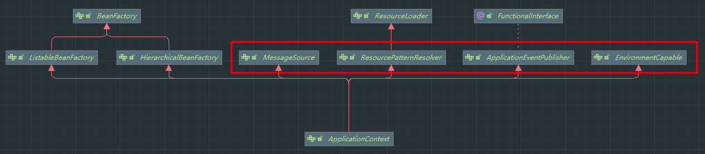

# 一、BeanFactory与ApplicationContext 功能概览

## 1. 导入

Springboot启动类：

```java
public class Demo01Application {
    public static void main(String[] args) {
        ConfigurableApplicationContext run = SpringApplication.run(Demo01Application.class, args);
    }
}
```

调用`ctrl`+`alt`+`u`，查看`ConfigurableApplicationContext`对应的类图：


由图可知，`ConfigurableApplicationContext`主要实现了`ApplicationContext`以及其余两个类，而`ApplicationContext`主要继承自`BeanFactory`，并在此基础上实现了扩展。

## 2. BeanFactory

### （1）什么是BeanFactory

- `BeanFactory`是`ApplicationContext`的父接口，

- 是Spring的核心容器，主要的 ApplicationContext 实现都【组合】了它的功能，【组合】是指 ApplicationContext 的一个重要成员变量就是 BeanFactory
- 在Spring Framework中，BeanFactory绝对是Spring IoC的核心担当：`BeanFactory` 在Spring中的主要作用，通过抽象Bean实例化的具体过程（体现在BeanDefinition定义），借助依赖注入（Dependency Inject，DI）的能力，实现基于元数据的业务对象自动装配，可以理解成增强版的Guice，如下图所示。

### （2）BeanFactory的功能

- getBean

```java
public static void main(String[] args) {
    ConfigurableApplicationContext context = SpringApplication.run(Demo01Application.class, args);
    Object aaa = context.getBean("aaa");
}

public abstract class AbstractApplicationContext extends DefaultResourceLoader implements ConfigurableApplicationContext {
    //忽略其他方法
    public Object getBean(String name) throws BeansException {
        this.assertBeanFactoryActive();
        return this.getBeanFactory().getBean(name);
    }
}
```

可知该类实现了`ConfigurableApplicationContext`，而`ConfigurableApplicationContext`又`implements`自`BeanFactory`，实现了`getBean()`功能

- 


## 3. ApplicationContext



ApplicationContext 是对 BeanFactory 的扩展 , 其中 `MessageSource`类用于处理国际化资源 , `ResourcePatternResolver`用于匹配资源(文件) , `ApplicationEventPublisher`用于发布事件对象 , `EnvironmentCapable`读取处理系统环境信息

### (1) MessageSource

在Spring框架中，我们可以使用MessageSource来管理应用程序的消息。这是一种非常方便的方式，可以帮助我们将消息从代码中分离出来，使得代码更加清晰，也更容易进行国际化。

使用该接口时首先需要在`resource`目录下创建messages_xx.properties文件 , xx是各种语言的代称 , 如中文(zh) , 英文(en)等等。

然后调用`ConfigurableApplicationContext`类的`getMessage`方法, 即可将指定词汇转换为不同的输出语言

```java
// 1. 在message_zh.properties中定义 hi=你好
// 2. ConfigurableApplicationContext对象调用getMessage方法
context.getMessage("hi", null, Locale.CHINA) // 将'hi'转换为中文 你好
```

### (2) ResourcePatternResolver

该接口用于解析带有*等通配符路径的资源文件，是ResourceLoader接口的拓展接口。

`PathMatchingResourcePatternResolver`是此接口的独立实现，其常常用于应用上下文之外如`ResourceArrayPropertyEditor`中

与此前的Resource接口不同的是：Resource它不支持通配符方式的文件读取，所以要将读取的配置文件名称全部写出来才可以。

```java
try {
    Resource[] resources = context.getResources("classpath*:META-INF/spring.factories");
    for (Resource resource : resources) {
        System.out.println(resource);
    }
} catch (IOException e) {
    throw new RuntimeException(e);
}
// 结果:
URL [jar:file:/D:/Program%20Files/Java/apache-maven-3.8.6/mave-repository/org/springframework/boot/spring-boot/2.7.6/spring-boot-2.7.6.jar!/META-INF/spring.factories]
URL [jar:file:/D:/Program%20Files/Java/apache-maven-3.8.6/mave-repository/org/springframework/spring-beans/5.3.24/spring-beans-5.3.24.jar!/META-INF/spring.factories]
URL [jar:file:/D:/Program%20Files/Java/apache-maven-3.8.6/mave-repository/org/springframework/boot/spring-boot-autoconfigure/2.7.6/spring-boot-autoconfigure-2.7.6.jar!/META-INF/spring.factories]
```

classpath是指从类路径下开始查找所有符合条件的文件 , 但不会查找 jar包内符合条件的文件

classpath*是包括jar包内的文件

除此之外还有 file:开头的资源查找 , 意思是从磁盘路径开始查找符合条件的资源文件

### (3) EnvironmentCapable

参考: [【Spring（十二）】EnvironmentCapable_绝世好阿狸的博客-CSDN博客](https://blog.csdn.net/u010900754/article/details/101784606)

这里的EnvironmentCapable接口就是可以获得一个[Environment](https://so.csdn.net/so/search?q=Environment&spm=1001.2101.3001.7020)实例。Environment也是一个接口，继承了PropertyResolver接口，是对获取属性的抽象。有两个常见的实现类：StandardEnvironment和StandardServletEnvironment，分别应用于非web和web应用中。

Spring高级容器ApplicationContext接口继承了EnvironmentCapable接口，所以具备了获取Environment的能力。其中的getEnvironment方法的实现是在AbstractApplicationContext中：

```java
@Override
public ConfigurableEnvironment getEnvironment() {
    if (this.environment == null) {
        this.environment = createEnvironment();
    }
    return this.environment;
}
protected ConfigurableEnvironment createEnvironment() {
    return new StandardEnvironment();
}
```

可以看到，第一次调用，会创建一个StandardEnvironment的实例。在该类中，会默认加载两种属性源：

```java
protected void customizePropertySources(MutablePropertySources propertySources) {
    propertySources.addLast(new MapPropertySource(SYSTEM_PROPERTIES_PROPERTY_SOURCE_NAME, getSystemProperties()));
    propertySources.addLast(new SystemEnvironmentPropertySource(SYSTEM_ENVIRONMENT_PROPERTY_SOURCE_NAME, getSystemEnvironment()));
}
```

分别是系统属性和jvm属性。我们可以直接在应用程序中获取。可以看一个例子：

```java
System.out.println(context.getEnvironment().getProperty("java_home"));		// D:\java\jdk17
System.out.println(context.getEnvironment().getProperty("server.port"));	// 8081
```

当然以上是非web应用的场景。对于web高级容器，则会创建不同的Environment。

### (4) ApplicationEventPublisher

平时开发中会发现Spring提供了一系列的工具满足我们的业务场景，其中有一项是提供了事件的发布和订阅。
事件的发布主要是依靠`ApplicationEventPublisher`来进行的。

要想实现事件发布主要需要下面几个对象：任务、事件、事件监听。

事件发布者:

```java
context.publishEvent(new Date());
```

事件监听者:

```java
@Component
public class Listener {

    Logger log = LoggerFactory.getLogger(Listener.class);

    @EventListener
    public void listen(Date date){
        log.info("订阅接收时间: {}",date);
    }
}
```

# 二、BeanFactory与ApplicationContext 功能实现

## 1. 容器实现

* DefaultListableBeanFactory，是 BeanFactory 最重要的实现，像**控制反转**和**依赖注入**功能，都是它来实现
* ClassPathXmlApplicationContext，从类路径查找 XML 配置文件，创建容器（旧）
* FileSystemXmlApplicationContext，从磁盘路径查找 XML 配置文件，创建容器（旧）
* XmlWebApplicationContext，传统 SSM 整合时，基于 XML 配置文件的容器（旧）
* AnnotationConfigWebApplicationContext，传统 SSM 整合时，基于 java 配置类的容器（旧）
* AnnotationConfigApplicationContext，Spring boot 中非 web 环境容器（新）
* AnnotationConfigServletWebServerApplicationContext，Spring boot 中 servlet web 环境容器（新）
* AnnotationConfigReactiveWebServerApplicationContext，Spring boot 中 reactive web 环境容器（新）

要注意的是，后面这些带有 ApplicationContext 的类都是 ApplicationContext 接口的实现，但它们是**组合**了 DefaultListableBeanFactory 的功能，并非继承而来。

## 2.DefaultListableBeanFactory

beanFactory 可以通过 registerBeanDefinition 注册一个 bean definition 对象

* 我们平时使用的配置类、xml、组件扫描等方式都是生成 bean definition 对象注册到 beanFactory 当中
* bean definition 描述了这个 bean 的创建蓝图：scope 是什么、用构造还是工厂创建、初始化销毁方法是什么，等等

```java
DefaultListableBeanFactory beanFactory = new DefaultListableBeanFactory();
// 刚创建的 DefaultListableBeanFactory 对象中并没有 bean 的存在 , 需要主动添加bean的定义
// bean的定义: 描述Bean的属性(class , scope , 初始化方法 , 销毁方法...) ,
// 由 DefaultListableBeanFactory 来生成真正的bean对象 (控制反转 | 依赖注入)

AbstractBeanDefinition beanDefinition = BeanDefinitionBuilder
    .genericBeanDefinition(Config.class)
    .setScope(BeanDefinition.SCOPE_SINGLETON)
    .getBeanDefinition();
beanFactory.registerBeanDefinition("config", beanDefinition);
```

beanFactory 需要手动调用 beanFactory 后处理器对它做增强

* 例如通过解析 @Configuration、@Bean 等注解，来补充一些 bean definition

```java
// 给 beanFactory 添加一些常用的后处理器
AnnotationConfigUtils.registerAnnotationConfigProcessors(beanFactory);
beanFactory.getBeansOfType(BeanFactoryPostProcessor.class).values().forEach(beanFactoryPostProcessor -> {
    beanFactoryPostProcessor.postProcessBeanFactory(beanFactory);
});
// 打印结果
org.springframework.context.annotation.internalConfigurationAnnotationProcessor	// 添加Configuration注解的Bean配置 , 其他同理
org.springframework.context.annotation.internalAutowiredAnnotationProcessor
org.springframework.context.annotation.internalCommonAnnotationProcessor
org.springframework.context.event.internalEventListenerProcessor
org.springframework.context.event.internalEventListenerFactory
```

- beanFactory 需要手动添加 bean 后处理器，以便对后续 bean 的创建过程提供增强

  * 例如 @Autowired，@Resource 等注解的解析都是 bean 后处理器完成的

  ```java
  beanFactory.getBeansOfType(BeanPostProcessor.class).values().stream()
      .forEach(beanPostProcessor -> {
          System.out.println(beanPostProcessor);
          beanFactory.addBeanPostProcessor(beanPostProcessor);
      });
  // 打印结果
  org.springframework.beans.factory.annotation.AutowiredAnnotationBeanPostProcessor@31206beb
  org.springframework.context.annotation.CommonAnnotationBeanPostProcessor@3e77a1ed
  ```

  

  * bean 后处理的添加顺序会对解析结果有影响，例如在直接注入时同时添加 @Autowired，@Resource , Bean实例会依据 @Autowired 注入 , 原因如上所示 , 在打印时先出现 AutowiredAnnotationBeanPostProcessor 处理器 , 在BeanFactory生成bean时会优先调用AutowiredAnnotationBeanPostProcessor 处理器 . 如果需要优先按照 @Resource 注入 , 需要改变 beanFactory 添加 Bean后处理器的顺序

  ```java
  beanFactory.getBeansOfType(BeanPostProcessor.class).values().stream()
      .sorted(beanFactory.getDependencyComparator())
      .forEach(beanPostProcessor -> {
          System.out.println(beanPostProcessor);
          beanFactory.addBeanPostProcessor(beanPostProcessor);
      });
  // 打印结果
  org.springframework.context.annotation.CommonAnnotationBeanPostProcessor@31206beb
  org.springframework.beans.factory.annotation.AutowiredAnnotationBeanPostProcessor@3e77a1ed
  ```

  

  * 在给BeanFactory注入 beanFactory 后处理器增强时就已经把 BeanFactory比较器一同注入了

  ```java
  AnnotationConfigUtils.registerAnnotationConfigProcessors(beanFactory);
  // AnnotationConfigUtils源码部分
  public static Set<BeanDefinitionHolder> registerAnnotationConfigProcessors(BeanDefinitionRegistry registry, @Nullable Object source) {
      
      DefaultListableBeanFactory beanFactory = unwrapDefaultListableBeanFactory(registry);
      if (beanFactory != null) {
          if (!(beanFactory.getDependencyComparator() instanceof AnnotationAwareOrderComparator)) {
              beanFactory.setDependencyComparator(AnnotationAwareOrderComparator.INSTANCE);
          }
          if (!(beanFactory.getAutowireCandidateResolver() instanceof ContextAnnotationAutowireCandidateResolver)) {
              beanFactory.setAutowireCandidateResolver(new ContextAnnotationAutowireCandidateResolver());
          }
      }
     // ...其他源码
  }
  ```

- beanFactory 需要手动调用方法来初始化单例

```java
beanFactory.preInstantiateSingletons(); // 调用该方法后会提前初始化单例的Bean对象 , 而不是等到真正调用时在执行初始化
```

- beanFactory 需要额外设置才能解析 ${} 与 #{}

