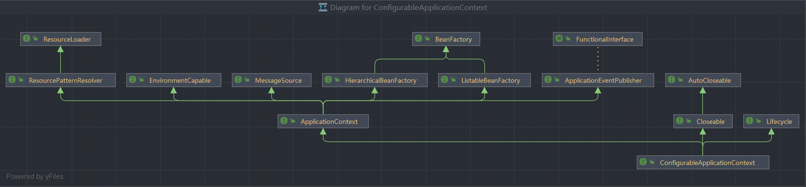
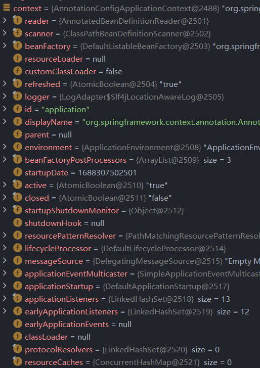

# 一、BeanFactory与ApplicationContext

## 1. 导入

Springboot启动类：

```java
public class Demo01Application {
    public static void main(String[] args) {
        ConfigurableApplicationContext run = SpringApplication.run(Demo01Application.class, args);
    }
}
```

调用`ctrl`+`alt`+`u`，查看`ConfigurableApplicationContext`对应的类图：



由图可知，`ConfigurableApplicationContext`主要实现了`ApplicationContext`以及其余两个类，而`ApplicationContext`主要继承自`BeanFactory`，并在此基础上实现了扩展。

## 2. BeanFactory

### （1）什么是BeanFactory

- `BeanFactory`是`ApplicationContext`的父接口，

- 是Spring的核心容器，主要的 ApplicationContext 实现都【组合】了它的功能，【组合】是指 ApplicationContext 的一个重要成员变量就是 BeanFactory
- 在Spring Framework中，BeanFactory绝对是Spring IoC的核心担当：`BeanFactory` 在Spring中的主要作用，通过抽象Bean实例化的具体过程（体现在BeanDefinition定义），借助依赖注入（Dependency Inject，DI）的能力，实现基于元数据的业务对象自动装配，可以理解成增强版的Guice，如下图所示。

### （2）BeanFactory的功能

- getBean

```java
public static void main(String[] args) {
    ConfigurableApplicationContext context = SpringApplication.run(Demo01Application.class, args);
    Object aaa = context.getBean("aaa");
}

public abstract class AbstractApplicationContext extends DefaultResourceLoader implements ConfigurableApplicationContext {
    //忽略其他方法
    public Object getBean(String name) throws BeansException {
        this.assertBeanFactoryActive();
        return this.getBeanFactory().getBean(name);
    }
}
```

可知该类实现了`ConfigurableApplicationContext`，而`ConfigurableApplicationContext`又`implements`自`BeanFactory`，实现了`getBean()`功能

- 

