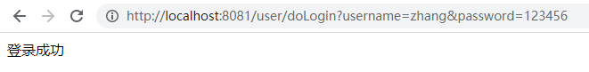
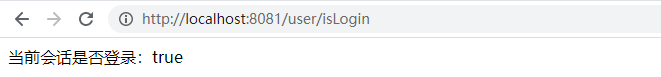
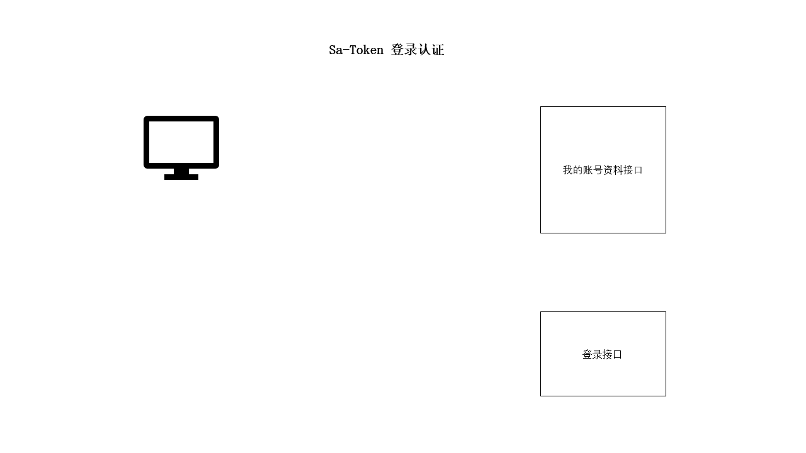

# 一、SaToken基础

## （一）SaToken简介

### 1. SaToken使用场景

Sa-Token 目前主要五大功能模块：登录认证、权限认证、单点登录、OAuth2.0、微服务鉴权。

- **登录认证** —— 单端登录、多端登录、同端互斥登录、七天内免登录
- **权限认证** —— 权限认证、角色认证、会话二级认证
- **Session会话** —— 全端共享Session、单端独享Session、自定义Session
- **踢人下线** —— 根据账号id踢人下线、根据Token值踢人下线
- **账号封禁** —— 登录封禁、按照业务分类封禁、按照处罚阶梯封禁
- **持久层扩展** —— 可集成Redis、Memcached等专业缓存中间件，重启数据不丢失
- **分布式会话** —— 提供jwt集成、共享数据中心两种分布式会话方案
- **微服务网关鉴权** —— 适配Gateway、ShenYu、Zuul等常见网关的路由拦截认证
- **单点登录** —— 内置三种单点登录模式：无论是否跨域、是否共享Redis，都可以搞定
- **OAuth2.0认证** —— 轻松搭建 OAuth2.0 服务，支持openid模式
- **二级认证** —— 在已登录的基础上再次认证，保证安全性
- **Basic认证** —— 一行代码接入 Http Basic 认证
- **独立Redis** —— 将权限缓存与业务缓存分离
- **临时Token认证** —— 解决短时间的Token授权问题
- **模拟他人账号** —— 实时操作任意用户状态数据
- **临时身份切换** —— 将会话身份临时切换为其它账号
- **前后端分离** —— APP、小程序等不支持Cookie的终端
- **同端互斥登录** —— 像QQ一样手机电脑同时在线，但是两个手机上互斥登录
- **多账号认证体系** —— 比如一个商城项目的user表和admin表分开鉴权
- **Token风格定制** —— 内置六种Token风格，还可：自定义Token生成策略、自定义Token前缀
- **注解式鉴权** —— 优雅的将鉴权与业务代码分离
- **路由拦截式鉴权** —— 根据路由拦截鉴权，可适配restful模式
- **自动续签** —— 提供两种Token过期策略，灵活搭配使用，还可自动续签
- **会话治理** —— 提供方便灵活的会话查询接口
- **记住我模式** —— 适配[记住我]模式，重启浏览器免验证
- **密码加密** —— 提供密码加密模块，可快速MD5、SHA1、SHA256、AES、RSA加密
- **全局侦听器** —— 在用户登陆、注销、被踢下线等关键性操作时进行一些AOP操作
- **开箱即用** —— 提供SpringMVC、WebFlux等常见web框架starter集成包，真正的开箱即用
- **更多功能正在集成中...** —— 如有您有好想法或者建议，欢迎加群交流

功能结构图：


### 2. 在springboot中的基础配置

1. 添加依赖

```xml
<!-- Sa-Token 权限认证，在线文档：https://sa-token.cc -->
<dependency>
    <groupId>cn.dev33</groupId>
    <artifactId>sa-token-spring-boot-starter</artifactId>
    <version>1.35.0.RC</version>
</dependency>
```

2. 配置参数

你可以**零配置启动项目** ，但同时你也可以在 `application.yml` 中增加如下配置，定制性使用框架：

```yaml
server:
    # 端口
    port: 8081
    
############## Sa-Token 配置 (文档: https://sa-token.cc) ##############
sa-token: 
    # token 名称（同时也是 cookie 名称）
    token-name: satoken
    # token 有效期（单位：秒） 默认30天，-1 代表永久有效
    timeout: 2592000
    # token 最低活跃频率（单位：秒），如果 token 超过此时间没有访问系统就会被冻结，默认-1 代表不限制，永不冻结
    active-timeout: -1
    # 是否允许同一账号多地同时登录 （为 true 时允许一起登录, 为 false 时新登录挤掉旧登录）
    is-concurrent: true
    # 在多人登录同一账号时，是否共用一个 token （为 true 时所有登录共用一个 token, 为 false 时每次登录新建一个 token）
    is-share: true
    # token 风格（默认可取值：uuid、simple-uuid、random-32、random-64、random-128、tik）
    token-style: uuid
    # 是否输出操作日志 
    is-log: true
```

3. 创建测试的Controller

```java
@RestController
@RequestMapping("/user/")
public class UserController {

    // 测试登录，浏览器访问： http://localhost:8081/user/doLogin?username=zhang&password=123456
    @RequestMapping("doLogin")
    public String doLogin(String username, String password) {
        // 此处仅作模拟示例，真实项目需要从数据库中查询数据进行比对 
        if("zhang".equals(username) && "123456".equals(password)) {
            StpUtil.login(10001);
            return "登录成功";
        }
        return "登录失败";
    }

    // 查询登录状态，浏览器访问： http://localhost:8081/user/isLogin
    @RequestMapping("isLogin")
    public String isLogin() {
        return "当前会话是否登录：" + StpUtil.isLogin();
    }   
}
```

4. 运行效果

启动代码，从浏览器依次访问上述测试接口：





### 3. 登录认证

#### （1）设计思路

对于一些登录之后才能访问的接口（例如：查询我的账号资料），我们通常的做法是增加一层接口校验：

- 如果校验通过，则：正常返回数据。
- 如果校验未通过，则：抛出异常，告知其需要先进行登录。

那么，判断会话是否登录的依据是什么？我们先来简单分析一下登录访问流程：

1. 用户提交 `name` + `password` 参数，调用登录接口。
2. 登录成功，返回这个用户的 Token 会话凭证。
3. 用户后续的每次请求，都携带上这个 Token。
4. 服务器根据 Token 判断此会话是否登录成功。

所谓登录认证，指的就是服务器校验账号密码，为用户颁发 Token 会话凭证的过程，这个 Token 也是我们后续判断会话是否登录的关键所在。



#### （2）登录流程源码解析

1. SaToken登录时调用函数：

```java
// 会话登录：参数填写要登录的账号id，建议的数据类型：long | int | String， 不可以传入复杂类型，如：User、Admin 等等
StpUtil.login(Object id);
```

2. 进入`login`方法的源码查看：

```java
public static void login(Object id) {
    stpLogic.login(id);
}
public void login(Object id) {
    this.login(id, new SaLoginModel());
}
public void login(Object id, SaLoginModel loginModel) {
    String token = this.createLoginSession(id, loginModel);
    this.setTokenValue(token, loginModel);
}
```

3. 首先会去创建会话session：

```java
public String createLoginSession(Object id, SaLoginModel loginModel) {
    //	检验账号id是否为空
    SaTokenException.throwByNull(id, "账号id不能为空", 11002);
    //	获取SaToken配置
    SaTokenConfig config = this.getConfig();
    //	创建SaLoginModel实例 , 赋予其timeout和isWriteHeader属性
    loginModel.build(config);
    //	判断是否为多端登录\是否能共享Token来生成一个Token
    String tokenValue = this.distUsableToken(id, loginModel);
    
    SaSession session = this.getSessionByLoginId(id, true);
    session.updateMinTimeout(loginModel.getTimeout());
    session.addTokenSign(tokenValue, loginModel.getDeviceOrDefault());
    this.saveTokenToIdMapping(tokenValue, id, loginModel.getTimeout());
    this.setLastActivityToNow(tokenValue);
    SaTokenEventCenter.doLogin(this.loginType, id, tokenValue, loginModel);
    if (config.getMaxLoginCount() != -1) {
        this.logoutByMaxLoginCount(id, session, (String)null, config.getMaxLoginCount());
    }
    return tokenValue;
}
```
