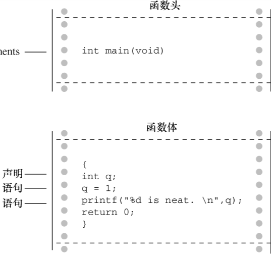

# C的程序结构

## 简单的 C 程序示例

```c
#include <stdio.h>
int main(void) /* 一个简单的 C 程序 */
{ 
	int num; /* 定义一个名为 num 的变量 */
	num = 1; /* 为 num 赋一个值 */
	printf("I am a simple "); /* 使用 printf()函数 */
	printf("computer.\n"); 
	printf("My favorite number is %d because it is first.\n",num);
	return 0;
}

// 输出结果:
I am a simple computer.
My favorite number is 1 because it is first.
```

## 示例解读


### 1. #include指令和头文件

> #include<stdio.h>

这是程序的第 1 行。 `#include <stdio.h>` 的作用相当于把 stdio.h 文件中的所有内容都输入该行所在的位置。实际上，这是一种“拷贝-粘贴”的操作。 include 文件提供了一种方便的途径共享许多程序共有的信息。

\#include 这行代码是一条 C 预处理器指令（preprocessor directive）。通常， C 编译器在编译前会对源代码做一些准备工作，即预处理（preprocessing）。

所有的 C 编译器软件包都提供 stdio.h 文件。该文件中包含了供编译器使用的输入和输出函数（如，printf()）信息。该文件名的含义是标准输入/输出头文件。通常，在 C 程序顶部的信息集合被称为头文件（header）。

在大多数情况下，头文件包含了编译器创建最终可执行程序要用到的信息。例如，头文件中可以定义一些常量，或者指明函数名以及如何使用它们。但是，函数的实际代码在一个预编译代码的库文件中。简而言之，头文件帮助编译器把你的程序正确地组合在一起。  

#include 中的`#`符号表明， C 预处理器在编译器接手之前处理这条指令。

### 2. main() 函数

> int main(void);

示例中的第 2 行表明该函数名为 main。的确， main 是一个极其普通的名称，但是这是唯一
的选择。 ==**C 程序一定从 main()函数开始执行**==（目前不必考虑例外的情况）。除了 main()函数，你可以任意命名其他函数，而且 main()函数必须是开始的函数。**==圆括号的作用是识别 main()是一个函数。==**
很快你将学到更多的函数。就目前而言，只需记住**==函数是 C 程序的基本模块==**。

int 是 main()函数的返回类型。这表明 main()函数返回的值是整数。返回到哪里？返回给操作系统。

通常，函数名后面的圆括号中包含一些传入函数的信息。该例中没有传递任何信息。因此，圆括号内是单词 void。

如果浏览旧式的 C 代码，会发现程序以如下形式开始：

> main()

C90 标准勉强接受这种形式，但是 C99 和 C11 标准不允许这样写。因此，即使你使用的编译器允许，也不要这样写。

你还会看到下面这种形式：

> void main()

一些编译器允许这样写，但是所有的标准都未认可这种写法。因此，编译器不必接受这种形式，而且许多编译器都不能这样写。需要强调的是，只要**==坚持使用标准形式==**，把程序从一个编译器移至另一个编译器时就不会出什么问题 。

### 3. 注释

多行注释：

```c
/* 这是一条 C 注释。 */

/* 这也是一条注释，
被分成两行。 */

/*
也可以这样写注释。
*/ 
```

 单行注释：

```c
int rigue; // 仅限于单行。可放在代码后面，但不可分段。
// 除非另起一行
```

### 4. 花括号、函数体和块

> {
>
> ​	函数体...
>
> }

示例代码中，花括号把 main()函数括起来。一般而言，所有的 C 函数都使用花括号标记函数体的
开始和结束。这是规定，不能省略。只有花括号`{}`能起这种作用，圆括号`()`和方括号`[]`都
不行。花括号还可用于把函数中的多条语句合并为一个单元或块。  

### 5. 声明

> int num;  

这行代码叫作声明（ declaration）。声明是 C 语言最重要的特性之一。在该例中，声明完成了两件事。其一，在函数中有一个名为 num 的变量（ variable）。其二， int 表明 num 是一个整数（即，没有小数点或小数部分的数）。 int 是一种数据类型。编译器使用这些信息为 num 变量在内存中分配存储空间。分号在 C 语言中是大部分语句和声明的一部分，不像在 Pascal 中只是语句间的分隔符。  

int 是 C 语言的一个关键字（keyword），表示一种基本的 C 语言数据类型。  

示例中的 num 是一个标识符（identifier），也就一个变量、函数或其他实体的名称。  

**==在 C 语言中，所有变量都必须先声明才能使用。这意味着必须列出程序中用到的所有变量名及其类型。==**  

### 6. 赋值

> num = 1;

程序清单中的这行代码是赋值表达式语句1。赋值是 C 语言的基本操作之一。该行代码的意思是“把值 1 赋给变量 num”。在执行` int num;`声明时，编译器在计算机内存中为变量 num 预留了空间，然后在执行这行赋值表达式语句时，把值储存在之前预留的位置。可以给 num 赋不同的值，这就是 num 之所以被称为变量（ variable）的原因。注意，该赋值表达式语句从右侧把值赋到左侧。  

**==C 语言是通过赋值运算符而不是赋值语句完成赋值操作。==**根据 C 标准， C 语言并没有所谓的“赋值语句”，一些其他书籍中提到的“赋值语句”实际上是表达式语句（ C 语言的 6 种基本语句之一）  

### 7. printf()函数

> printf("I am a simple ");
> 		printf("computer.\n");
> 		printf("My favorite number is %d because it is first.\n", num);  

第 1 行把 `I am a simple `传递给printf()函数。该信息被称为参数，或者更确切地说，是函数的实际参数（actual argument），在 C 语言中， 实际参数（简称实参）是传递给函数的特定值， 形式参数（简称形参）是函数中用于储存值的变量。printf()函数用参数来做什么？该函数会查看双引号中的内容，并将其打印在屏幕上。  

`\n `的意思是换行。 `\n `组合（依次输入这两个字符）代表一个换行符（newline character）。对于 printf()而言，它的意思是“在下一行的最左边开始新的一行”。  

换行符是一个转义序列（escape sequence）。转义序列用于代表难以表示或无法输入的字符。如，` \t `代表 Tab 键， `\b` 代表 Backspace 键（退格键）。每个转义序列都以反斜杠字符（\）开始。  

`%d` 相当于是一个占位符，其作用是指明输出 num 值的位置  

### 8. return 语句

> return 0;

return 语句1是程序清单 2.1 的最后一条语句。 int main(void)中的 int 表明 main()函数应返回一个整数。 C 标准要求 main()这样做。有返回值的 C 函数要有 return 语句。该语句以 return 关键字开始，后面是待返回的值，并以分号结尾。  

## C 程序的基本结构

程序由一个或多个函数组成，必须有 main()函数。 函数由函数头和函数体组成。 函数头包括函数名、传入该函数的信息类型和函数的返回类型。通过函数名后的圆括号可识别出函数，圆括号里可能为空，可能有参数。 函数体被花括号括起来，由一系列语句、声明组成，  最后， main()以 return 语句结束。  



## 关键字和保留标识符

关键字是 C 语言的词汇。它们对 C 而言比较特殊，不能用它们作为标识符（如，变量名）。许多关键字用于指定不同的类型，如 int。还有一些关键字（如， if）用于控制程序中语句的执行顺序。在下表中所列的 C 语言关键字中，粗体表示的是 C90 标准新增的关键字，斜体表示的 C99 标准新增的关键字，粗斜体表示的是 C11 标准新增的关键字。  

ISO C 关键字

|          |          |              |                      |
| -------- | -------- | ------------ | -------------------- |
| auto     | extern   | short        | while                |
| break    | float    | **signed**   | ***_Alignas***       |
| case     | for      | sizeof       | ***_Alignof***       |
| char     | goto     | static       | ***_Atomic***        |
| const    | if       | struct       | ***_Bool***          |
| continue | inline   | switch       | ***_Complex***       |
| default  | int      | typedef      | ***_Generic***       |
| do       | long     | union        | ***_Imaginary***     |
| double   | register | unsigned     | ***_Noreturn***      |
| else     | restrict | void         | ***_Static_assert*** |
| **enum** | return   | **volatile** | ***_Thread_local***  |

如果使用关键字不当（如，用关键字作为变量名），编译器会将其视为语法错误。还有一些保留标识符（reserved identifier）， C 语言已经指定了它们的用途或保留它们的使用权，如果你使用这些标识符来表示其他意思会导致一些问题。因此，尽管它们也是有效的名称，不会引起语法错误，也不能随便使用。保留标识符包括那些以下划线字符开头的标识符和标准库函数名，如 printf()。  