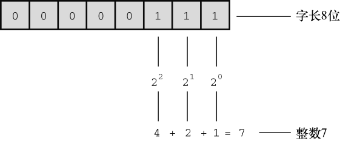
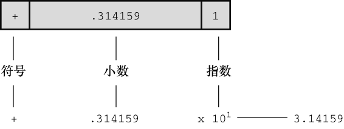
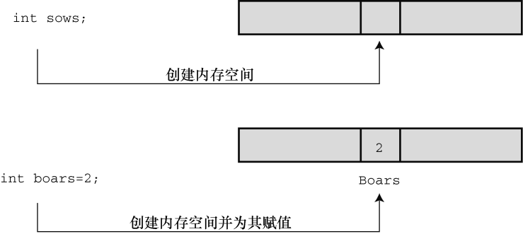

# C的数据类型

## 1. 变量与常量数据

```c
float value = 1700.0 * weight * 14.5833;
```

有些数据类型在程序使用之前已经预先设定好了，在整个程序的运行过程中没有变化，这些称为常量（constant）。其他数据类型在程序运行期间可能会改变或被赋值，这些称为变量（variable）。在示例中， `value`是一个变量， 14.5833 和 1700.0 是一个常量。

## 2. 数据类型

### 2.1 数据类型关键字

不仅变量和常量不同，不同的数据类型之间也有差异。一些数据类型表示数字，一些数据类型表示字母（更普遍地说是字符）。 C 通过识别一些基本的数据类型来区分和使用这些不同的数据类型。如果数据是常量，编译器一般通过用户书写的形式来识别类型（如， 42 是整数， 42.100 是浮点数）。但是，**==对变量而言，要在声明时指定其类型。==**

| 最初 K&R 给出的关键字 | C90 标准添加的关键字 | C99 标准添加的关键字 |
| --------------------- | -------------------- | -------------------- |
| int                   | signed               | _Bool                |
| long                  | void                 | _Complex             |
| short                 | _Imaginary           |                      |
| unsigned              |                      |                      |
| char                  |                      |                      |
| float                 |                      |                      |
| double                |                      |                      |

在 C 语言中，用 int 关键字来表示基本的整数类型。后 3 个关键字（`long`、 `short` 和 `unsigned`）
和 C90 新增的 `signed `用于提供基本整数类型的变式，例如 `unsigned short int` 和 `long long int`。`char `关键字用于指定字母和其他字符（如， #、 $、 %和*）。另外， `char `类型也可以表示较小的整数。 `float`、`double `和 `long double` 表示带小数点的数。 `_Bool `类型表示布尔值（true 或 false）， `_complex `和 `_Imaginary `分别表示复数和虚数。  

通过这些关键字创建的类型，按计算机的储存方式可分为两大基本类型： 整数类型和浮点数类型。  

### 2.2 位、字节和字

位、字节和字是描述计算机数据单元或存储单元的术语。这里主要指存储单元。

 最小的存储单元是位（ bit）， 可以储存 0 或 1（或者说，位用于设置“开”或“关”）。虽然 1 位储 存的信息有限，但是计算机中位的数量十分庞大。**==位是计算机内存的基本构建块。==**

字节（ byte）是常用的计算机存储单位。对于几乎所有的机器， 1 字节均为 8 位。这是字节的标准定义，至少在衡量存储单位时是这样（但是， C 语言对此有不同的定义，请参阅本章 3.4.3 节）。既然 1 位可以表示 0 或 1，那么 8 位字节就有 256（ 2 的 8 次方）种可能的 0、 1 的组合。 通过二进制编码（仅用 0 和 1 便可表示数字），便可表示 0～255 的整数或一组字符。

字（ word） 是设计计算机时给定的自然存储单位。 对于 8 位的微型计算机（如，最初的苹果机）， 1 个字长只有 8 位。从那以后，个人计算机字长增至 16 位、 32 位，直到目前的 64 位。计算机的字长 越大，其数据转移越快，允许的内存访问也更多。

### 2.3 整数

和数学的概念一样，在 C 语言中， 整数是没有小数部分的数。例如， 2、 -23 和 2456 都是整数。而 3.14、0.22 和 2.000 都不是整数。计算机以二进制数字储存整数，例如，整数 7 以二进制写是 111。因此，要在 8 位字节中储存该数字，需要把前 5 位都设置成 0，后 3 位设置成 1  。



### 2.4 浮点数

浮点数与数学中实数的概念差不多。 2.75、 3.16E7、 7.00 和 2e-8 都是浮点数。注意，在一个值后面加上一个小数点，该值就成为一个浮点值。所以， 7 是整数， 7.00 是浮点数。显然，书写浮点数有多种形式。

> e计数法
>
> 稍后将详细介绍 e 记数法，这里先做简要介绍： 3.16E7 表示 3.16× 107（3.16 乘以 10 的 7 次方）。其中，107=10000000， 7 被称为 10 的指数。  

这里关键要理解浮点数和整数的储存方案不同。计算机把浮点数分成小数部分和指数部分来表示，而且分开储存这两部分。因此，虽然 7.00 和 7 在数值上相同，但是它们的储存方式不同。在十进制下，可以把 7.0 写成 0.7E1。这里， 0.7 是小数部分， 1 是指数部分。下图演示了一个储存浮点数的例子。当然，计算机在内部使用二进制和 2 的幂进行储存，而不是 10 的幂。第 15 章将详述相关内容。现在，我们着重讲解这两种类型的实际区别。

- 整数没有小数部分，浮点数有小数部分。
- 浮点数可以表示的范围比整数大。
- 对于一些算术运算（如，两个很大的数相减），浮点数损失的精度更多。
- 因为在任何区间内（如， 1.0 到 2.0 之间）都存在无穷多个实数，所以计算机的浮点数不能表示区间内所有的值。浮点数通常只是实际值的近似值。例如， 7.0 可能被储存为浮点值 6.99999。
- 过去，浮点运算比整数运算慢。不过，现在许多 CPU 都包含浮点处理器，缩小了速度上的差距。



## 3. C语言基本数据类型

### 3.1 int 类型

##### 定义

int 类型是**有符号整型**，即 int 类型的值必须是整数， 可以是正整数、负整数或零。其取值范围依计算机系统而异。**==一般而言，储存一个 int 要占用一个机器字长。==**

早期的 16 位 IBM PC 兼容机使用16 位来储存一个 int 值，其取值范围（即 int 值的取值范围）是-32768～32767。   目前的个人计算机一般是 32 位，因此**用 32 位储存一个 int 值**。 ISO C 规定 int 的取值范围最小为-32768～32767。一般而言，系统用一个特殊位的值表示有符号整数的正负号。  

##### 声明 int 变量

先写上 int，然后写变量名，最后加上一个分号。要声明多个变量，可以单独声明每个变量，也可在 int 后面列出多个变量名，变量名之间用逗号分隔。下面都是有效的声明：  

```c
int erns;
int hogs, cows, goats;
```

可以分别在 4 条声明中声明各变量，也可以在一条声明中声明 4 个变量。两种方法的效果相同，都为 4 个 int 大小的变量赋予名称并分配内存空间。

##### 初始化变量

初始化（ initialize）变量就是为变量赋一个初始值。在 C 语言中，初始化可以直接在声明中完成。只需在变量名后面加上赋值运算符（ =）和待赋给变量的值即可。如下所示：

```c
int hogs = 21;  
int cows = 32, goats = 14;
```

简而言之，声明为变量创建和标记存储空间，并为其指定初始值。



##### 八进制和十六进制  

通常， C 语言都假定整型常量是十进制数。然而，许多程序员很喜欢使用八进制和十六进制数。因为 8 和 16 都是 2 的幂，而 10 却不是。显然，八进制和十六进制记数系统在表达与计算机相关的值时很方便。 

另外，十六进制数的每一位的数恰好由 4 位二进制数表示。例如，十六进制数 3 是 0011，十六进制数 5 是 0101。因此，十六进制数 35 的位组合（bit pattern） 是 00110101，十六进制数 53 的位组合是 01010011。 

在 C 语言中，用特定的前缀表示使用哪种进制。 0x 或 0X 前缀表示十六进制值，所以十进制数 16 表示成十六进制是 0x10 或 0X10。与此类似， 0 前缀表示八进制。例如，十进制数 16 表示成八进制是 020。  

> 要清楚，使用不同的进制数是为了方便，不会影响数被储存的方式。也就是说，无论把数字写成 16、020 或 0x10，储存该数的方式都相同，因为计算机内部都以二进制进行编码。  

##### 显示八进制和十六进制

在 C 程序中，既可以使用和显示不同进制的数。不同的进制要使用不同的转换说明。以十进制显示数字，使用%d；以八进制显示数字，使用%o；以十六进制显示数字，使用%x。另外，要显示各进制数的前缀0、 0x 和 0X，必须分别使用%#o、 %#x、 %#X。

```c
/* bases.c--以十进制、八进制、十六进制打印十进制数 100 */
#include <stdio.h>
int main(void)
{
    int x = 100;
    printf("dec = %d; octal = %o; hex = %x\n", x, x, x);
    printf("dec = %d; octal = %#o; hex = %#x\n", x, x, x);
    return 0;
}

// 输出结果
dec = 100; octal = 144; hex = 64
dec = 100; octal = 0144; hex = 0x64
```

该程序以 3 种不同记数系统显示同一个值。 printf()函数做了相应的转换。注意，如果要在八进制和十六进制值前显示 0 和 0x 前缀，要分别在转换说明中加入#。

### 3.2 其他整数类型

C 语言提供 3 个附属关键字修饰基本整数类型： short、 long 和 unsigned。应记住以下几点。

- **short int 类型（或者简写为 short）占用的存储空间可能比 int 类型少，常用于较小数值的场合以节省空间。**与 int 类似， short 是有符号类型。
- **long int 或 long 占用的存储空间可能比 int 多，适用于较大数值的场合。**与 int 类似， long 是有符号类型。
- **long long int 或 long long（C99 标准加入）占用的储存空间可能比 long 多，适用于更大数值的场合。**该类型至少占 64 位。与 int 类似， long long 是有符号类型。
- **unsigned int 或 unsigned 只用于非负值的场合。**这种类型与有符号类型表示的范围不同。例如， 16 位 unsigned int 允许的取值范围是 0～65535，而不是-32768～32767。 用于表示正负号的位现在用于表示另一个二进制位，所以无符号整型可以表示更大的数。
- 在 C90 标准中，添加了 unsigned long int 或 unsigned long 和 unsigned int 或 unsigned short 类型。 C99 标准又添加了 unsigned long long int 或 unsigned long long。
- **在任何有符号类型前面添加关键字 signed，可强调使用有符号类型的意图。**例如， short、 short int、 signed short、 signed short int 都表示同一种类型。
