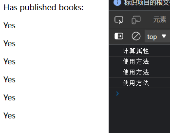
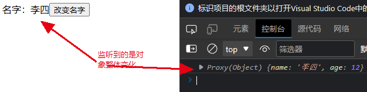
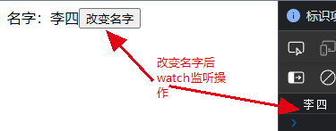

# 一、响应式基础

## （一）data 函数

​		选用选项式 API 时，会用 `data` 选项来声明组件的响应式状态。此选项的值应为返回一个对象的函数。Vue 将在创建新组件实例的时候调用此函数，并将函数返回的对象用响应式系统进行包装。此对象的所有顶层属性都会被代理到组件实例 (即方法和生命周期钩子中的 `this`) 上。

```vue
<script>
export default {
  data() {
    return {
      count: 1
    }
  },
  mounted() {
    // this 指的是组件实例
    console.log(this.count) // => 1
    // data中的count会发生变化
    this.count = 2
  }
}
</script>
<template>
  Count is: {{ count }}
</template>
```

​		这些实例上的属性仅在实例首次创建时被添加，因此你需要确保它们都出现在 `data` 函数返回的对象上。若所需的值还未准备好，在必要时也可以使用 `null`、`undefined` 或者其他一些值占位。

​		虽然也可以不在 `data` 上定义，直接向组件实例添加新属性，但这个属性将无法触发响应式更新。

​		Vue 在组件实例上暴露的内置 API 使用 `$` 作为前缀。同时也为内部属性保留 `_` 前缀。因此，应该避免在顶层 `data` 上使用任何以这些字符作前缀的属性。

## （二）methods 方法

​		用`methods()`向组件实例中添加方法，它应该是一个包含所需方法的对象。

​		Vue 自动为 methods 绑定 this，以便于它始终指向组件实例。这将确保方法在用作事件监听或回调时保持正确的 this 指向。**在定义 methods 时应避免使用箭头函数，因为这会阻止 Vue 绑定恰当的 this 指向**。

​		这些 methods 和组件实例的其它所有 property 一样可以在组件的模板中被访问。在模板中，它们通常被当做事件监听使用：

```vue
<script>
export default {
  data() {
    return {
      count: 1
    }
  },

  // `mounted` is a lifecycle hook which we will explain later
  methods: {
    add(){
      this.count++;
    }
  }
}
</script>
<template>
  <button @click="add">{{count}}</button>
</template>
```

​		在上面的例子中，点击 <button> 时，会调用 add 方法。

​		也可以直接从模板中调用方法。就像下一章节即将看到的，通常换做计算属性会更好。但是，在计算属性不可行的情况下，使用方法可能会很有用。也可以在模板支持 JavaScript 表达式的任何地方调用方法，参考 [day01](../day01/day01—简介、模板语法.md)中的 <u>使用Javascript表达式</u> 一节。

## （三）DOM 更新时机

​		当你更改响应式状态后，DOM 会自动更新。然而，你得注意 DOM 的更新并不是同步的。相反，Vue 将缓冲它们直到更新周期的 “下个时机” 以确保无论你进行了多少次状态更改，每个组件都只更新一次。

​		若要等待一个状态改变后的 DOM 更新完成，你可以使用 [nextTick()](https://cn.vuejs.org/api/general.html#nexttick) 这个全局 API：

```vue
import { nextTick } from 'vue'

export default {
  methods: {
    increment() {
      this.count++
      nextTick(() => {
        // 访问更新后的 DOM
      })
    }
  }
}
```

## （四）深层响应性

​		在 Vue 中，状态都是默认深层响应式的。这意味着即使在更改深层次的对象或数组，你的改动也能被检测到。

```js
export default {
  data() {
    return {
      obj: {
        nested: { count: 0 },
        arr: ['foo', 'bar']
      }
    }
  },
  methods: {
    mutateDeeply() {
      // 以下都会按照期望工作
      this.obj.nested.count++
      this.obj.arr.push('baz')
    }
  }
}
```

​		也可以直接创建一个[浅层响应式对象](https://cn.vuejs.org/api/reactivity-advanced.html#shallowreactive)。它们仅在顶层具有响应性，一般仅在某些特殊场景中需要。

## （五）有状态方法

​		在某些情况下，我们可能需要动态地创建一个方法函数，比如创建一个预置防抖的事件处理器：

```js
import { debounce } from 'lodash-es'

export default {
  methods: {
    // 使用 Lodash 的防抖函数
    click: debounce(function () {
      // ... 对点击的响应 ...
    }, 500)
  }
}
```

​		不过这种方法对于被重用的组件来说是有问题的，因为这个预置防抖的函数是 **有状态的**：它在运行时维护着一个内部状态。如果多个组件实例都共享这同一个预置防抖的函数，那么它们之间将会互相影响。

​		要保持每个组件实例的防抖函数都彼此独立，我们可以改为在 `created` 生命周期钩子中创建这个预置防抖的函数：

```js
export default {
  created() {
    // 每个实例都有了自己的预置防抖的处理函数
    this.debouncedClick = _.debounce(this.click, 500)
  },
  unmounted() {
    // 最好是在组件卸载时
    // 清除掉防抖计时器
    this.debouncedClick.cancel()
  },
  methods: {
    click() {
      // ... 对点击的响应 ...
    }
  }
}
```


# 二、计算属性和侦听器

## （一）基础示例

​		模板中的表达式虽然方便，但也只能用来做简单的操作。如果在模板中写太多逻辑，会让模板变得臃肿，难以维护。比如说，我们有这样一个包含嵌套数组的对象：

```js
<script>
export default{
  data(){
    return{
      author: {
        name: 'John Doe',
        books: [
          'Vue 2 - Advanced Guide',
          'Vue 3 - Basic Guide',
          'Vue 4 - The Mystery'
        ]
      }
    }
  }
}
</script>
<template class="logo">
  <p>Has published books:</p>
  <span>{{ author.books.length > 0 ? 'Yes' : 'No' }}</span>
</template>
```

​		我们想根据 `author` 是否已有一些书籍来展示不同的信息。这里的模板看起来有些复杂。我们必须认真看好一会儿才能明白它的计算依赖于 `author.books`。更重要的是，如果在模板中需要不止一次这样的计算，我们可不想将这样的代码在模板里重复好多遍。

​		因此Vue推荐使用**计算属性**来描述依赖响应式状态的复杂逻辑。这是重构后的示例：

```js
<script>
export default {
  data() {
    return {
      author: {
        name: 'John Doe',
        books: [
          'Vue 2 - Advanced Guide',
          'Vue 3 - Basic Guide',
          'Vue 4 - The Mystery'
        ]
      }
    }
  },
  computed: {
    publishedBooksMessage() {
      return this.author.books.length > 0 ? 'Yes' : 'No'
    }
  }
}
</script>
<template>
  <p>Has published books:</p>
  <span>{{ publishedBooksMessage }}</span>
</template>
```

​		我们在这里定义了一个计算属性 `publishedBooksMessage`。

​		更改此应用的 `data` 中 `books` 数组的值后，可以看到 `publishedBooksMessage` 也会随之改变。

​		在模板中使用计算属性的方式和一般的属性并无二致。Vue 会检测到 `this.publishedBooksMessage` 依赖于 `this.author.books`，所以当 `this.author.books` 改变时，任何依赖于 `this.publishedBooksMessage` 的绑定都将同时更新。

## （二）计算属性缓存 vs 方法

​		你可能注意到我们在表达式中像这样调用一个函数也会获得和计算属性相同的结果：

```html
<script>
export default {
  data() {
    return {
      author: {
        name: 'John Doe',
        books: [
          'Vue 2 - Advanced Guide',
          'Vue 3 - Basic Guide',
          'Vue 4 - The Mystery'
        ]
      }
    }
  },
  computed: {
    publishedBooksMessage() {
      console.log("计算属性")
      return this.author.books.length > 0 ? 'Yes' : 'No'
    }
  },
  methods: {
    calculateBooksMessage() {
      console.log("使用方法")
      return this.author.books.length > 0 ? 'Yes' : 'No'
    }
  }
}
</script>
<template>
  <p>Has published books:</p>
  <!-- 计算属性 -->
  <p>{{ publishedBooksMessage }}</p>
  <p>{{ publishedBooksMessage }}</p>
  <p>{{ publishedBooksMessage }}</p>
  <!-- 使用方法 -->
  <p>{{ calculateBooksMessage() }}</p>
  <p>{{ calculateBooksMessage() }}</p>
  <p>{{ calculateBooksMessage() }}</p>
</template>
```

​		若我们将同样的函数定义为一个方法而不是计算属性，两种方式在结果上确实是完全相同的，然而，不同之处在于**计算属性值会基于其响应式依赖被缓存**。一个计算属性仅会在其响应式依赖更新时才重新计算。这意味着只要 `author.books` 不改变，无论多少次访问 `publishedBooksMessage` 都会立即返回先前的计算结果，而不用重复执行 getter 函数。



​		这也解释了为什么下面的计算属性永远不会更新，因为 `Date.now()` 并不是一个响应式依赖：

```js
computed: {
  now() {
    return Date.now()
  }
}
```

​		相比之下，方法调用**总是**会在重渲染发生时再次执行函数。

​		为什么需要缓存呢？想象一下我们有一个非常耗性能的计算属性 `list`，需要循环一个巨大的数组并做许多计算逻辑，并且可能也有其他计算属性依赖于 `list`。没有缓存的话，我们会重复执行非常多次 `list` 的 getter，然而这实际上没有必要！如果你确定不需要缓存，那么也可以使用方法调用。

## （三）可写计算属性

​		计算属性默认是只读的。当你尝试修改一个计算属性时，你会收到一个运行时警告。只在某些特殊场景中你可能才需要用到“可写”的属性，你可以通过同时提供 getter 和 setter 来创建：

```js
export default {
  data() {
    return {
      firstName: 'John',
      lastName: 'Doe'
    }
  },
  computed: {
    fullName: {
      // getter
      get() {
        return this.firstName + ' ' + this.lastName
      },
      // setter
      set(newValue) {
        // 注意：我们这里使用的是解构赋值语法
        [this.firstName, this.lastName] = newValue.split(' ')
      }
    }
  }
}
```

​		现在当你再运行 `this.fullName = 'John Doe'` 时，setter 会被调用而 `this.firstName` 和 `this.lastName` 会随之更新。

## （四）注意事项

### 1. Getter 不应有副作用

​		计算属性的 getter 应只做计算而没有任何其他的副作用，这一点非常重要，请务必牢记。举例来说，**不要在 getter 中做异步请求或者更改 DOM**！一个计算属性的声明中描述的是如何根据其他值派生一个值。因此 getter 的职责应该仅为计算和返回该值。在之后的指引中我们会讨论如何使用[监听器](https://cn.vuejs.org/guide/essentials/watchers.html)根据其他响应式状态的变更来创建副作用。

### 2. 避免直接修改计算属性值

​		从计算属性返回的值是派生状态。可以把它看作是一个“临时快照”，每当源状态发生变化时，就会创建一个新的快照。更改快照是没有意义的，因此计算属性的返回值应该被视为只读的，并且永远不应该被更改——应该更新它所依赖的源状态以触发新的计算。

## （五）侦听器

### 1. 监听函数

​		虽然计算属性在大多数情况下更合适，但有时也需要一个自定义的侦听器。这就是为什么 Vue 通过 `watch` 选项提供了一个更通用的方法，来响应数据的变化。当需要在数据变化时执行异步或开销较大的操作时，这个方式是最有用的。

```html
<script>
export default {
  data() {
    return {
      message:"hello world"
    }
  },
  methods: {
  },
  watch:{   //  监听数据的变化
    message: function(newValue,oldValue){
      console.log(newValue+' '+oldValue);
      // 监测到数据变化后可以执行异步或其他复杂代码逻辑
      if(newValue.length<5 || newValue.length>10){
        console.log("输入内容长度必须在5-10之间")
      }else{
        console.log("输入正确")
      }
    }
  }
}
</script>
<template>
  <p>{{message}}</p>
  <input type="text" v-model="message">
  <button @click="message=message==='你好 世界'?'hello world':'你好 世界'">{{ message }}</button>
</template>
```

### 2. watch深度监听

​		当需要监听一个对象的改变时，以上的监听方式已经不能满足，原因是受到 JavaScript 的限制(以及废弃 Object.observe)，Vue 不能检测到对象属性的添加或删除，导致我们对一个对象的监听是无效的。

​		此时，我们需要使用 deep 属性对对象进行深度监听。

```html
<script>
export default {
  data() {
    return {
      user:{
        name:"张三"
      }
    }
  },
  methods: {
  },
  watch:{   //  监听数据的变化
    user: {
      handler:function(newValue){
        console.log(newValue)
      },
      deep:true //  表示是否进行深度监听，侦听器会一层一层的向下遍历，给对象的每一个属性都加上侦听器
    }
  }
}
</script>
<template>
  <span>名字：{{ user.name }}</span>
  <button @click="user.name='李四'">改变名字</button>
</template>
```



​		deep 的默认值是 false，为什么？因为使用了 deep 之后，监听器就会一层层的往下遍历，这样做可想而知对性能的开销非常的大，当我们只需要对一个对象里的某个属性进行监听时，可以使用 **字符串形式监听**。如此，Vue 就会一层一层解析下去，直到遇到需要监听的属性，给其设置监听函数。

```html
<script>
export default {
  data() {
    return {
      user:{
        name:"张三",
        age:12
      }
    }
  },
  methods: {
  },
  watch:{   //  监听数据的变化
    "user.name": {
      handler:function(newValue){
        console.log(newValue)
      },
      deep:true //  表示是否进行深度监听，侦听器会一层一层的向下遍历，给对象的每一个属性都加上侦听器
    }
  }
}
</script>
<template>
  <span>名字：{{ user.name }}</span>
  <button @click="user.name='李四'">改变名字</button>
</template>
```



# 三、class 与 style 绑定

​		数据绑定的一个常见需求场景是操纵元素的 CSS class 列表和内联样式。因为 `class` 和 `style` 都是 attribute，我们可以和其他 attribute 一样使用 `v-bind` 将它们和动态的字符串绑定。但是，在处理比较复杂的绑定时，通过拼接生成字符串是麻烦且易出错的。因此，Vue 专门为 `class` 和 `style` 的 `v-bind` 用法提供了特殊的功能增强。除了字符串外，表达式的值也可以是对象或数组。

## （一）绑定 HTML class

### 1. 绑定对象

​		我们可以给 `:class` (`v-bind:class` 的缩写) 传递一个对象来动态切换 class：

```html
<div :class="{ className: Boolean }"></div>
```

​		上面的语法表示 `className` 是否存在取决于数据属性 `Boolean` 的[真假值](https://developer.mozilla.org/en-US/docs/Glossary/Truthy)。

```html
<script>
export default {
  data() {
    return {
      isActive:true
    }
  }
}
</script>
<template>
  <p class="active">这是字符串绑定class</p>
  <p :class="{active:isActive}">这是v-bind动态绑定class</p>
  <button @click="isActive=!isActive">绑定样式</button>
</template>
<style scoped>
.active{
  font-size: 50px;
}
</style>
```

​		可以在对象中写多个字段来操作多个 class。此外，`:class` 指令也可以和一般的 `class` attribute 共存。举例来说，下面这样的状态：

```html
<script>
export default {
  data() {
    return {
      isActive: true,
      hasError: false
    }
  }
}
</script>
<template>
  <div class="static" :class="{ active: isActive, 'text-danger': hasError }">
    这是内容
  </div>
</template>
<style scoped>
.active{
  font-size: 50px;
}
</style>
```

​		绑定的对象并不一定需要写成内联字面量的形式，也可以直接绑定一个对象：

```html
<script>
export default {
  data() {
    return {
      classObject: {
        active: true,
        'text-danger': false
      }
    }
  }
}
</script>
<template>
  <div class="static" :class="classObject">
    这是内容
  </div>
</template>
<style scoped>
.active{
  font-size: 50px;
}
</style>
```

​		我们也可以绑定一个返回对象的[计算属性](https://cn.vuejs.org/guide/essentials/computed.html)。这是一个常见且很有用的技巧：

```html
<script>
export default {
  data() {
    return {
      isActive: true,
      error: {}
    }
  },
  computed: {
    classObject() {
      return {
        active: this.isActive && !this.error,
        'text-danger': this.error	// 当值为false或null时表示否，其他情况皆可表示true
      }
    }
  }
}
</script>
<template>
  <div class="static" :class="classObject">
    这是内容
  </div>
</template>
<style scoped>
.active{
  font-size: 50px;
}
</style>
```

### 2. 绑定数组

