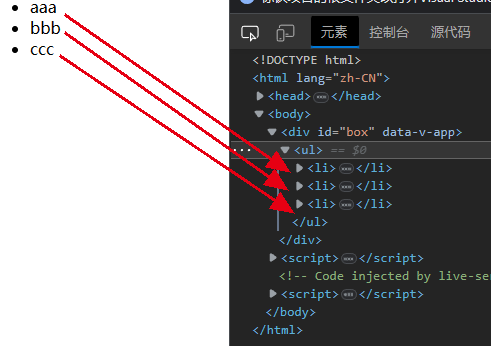

# 一、条件渲染

## （一）v-if

### 1. v-if的基本使用

`v-if` 指令用于条件性地渲染一块内容。这块内容只会在指令的表达式返回真值时才被渲染。

`v-else-if` 提供的是相应于 `v-if` 的“else if 区块”。它可以连续多次重复使用。

也可以使用 `v-else` 为 `v-if` 添加一个“else 区块”。

```html
<!DOCTYPE html>
<html lang="zh-CN">
<head>
    <meta charset="UTF-8">
    <meta http-equiv="X-UA-Compatible" content="IE=edge">
    <meta name="viewport" content="width=device-width, initial-scale=1.0">
    <title>v-if条件渲染案例</title>
    <script src="./vue.js"></script>
</head>
<body>
    <div id="box">
        <ul>
            <li v-for="item in dataList">
                {{item.title}}
                <div v-if="item.state===0">待付款</div>
                <div v-else-if="item.state===1">已付款</div>
                <div v-else>已发货</div>
            </li>
        </ul>
    </div>
    <script>
        var obj = {
            data(){
                return {
                    dataList:[
                        {title:"手机1",state:0},
                        {title:"手机2",state:2},
                        {title:"手机3",state:1}
                    ]
                }
            }
        }
        var app = Vue.createApp(obj).mount("#box");
    </script>
</body>
</html>
```

### 2. `<template>` 上的 `v-if`

因为 `v-if` 是一个指令，他必须依附于某个元素。但如果我们想要切换不止一个元素呢？在这种情况下我们可以在一个 `<template>` 元素上使用 `v-if`，这只是一个不可见的包装器元素，最后渲染的结果并不会包含这个 `<template>` 元素。

```html
<!DOCTYPE html>
<html lang="zh-CN">
<head>
    <meta charset="UTF-8">
    <meta http-equiv="X-UA-Compatible" content="IE=edge">
    <meta name="viewport" content="width=device-width, initial-scale=1.0">
    <title>v-if条件渲染案例</title>
    <script src="./vue.js"></script>
</head>
<body>
    <div id="box">
        <template v-if="show">
            <ul>
                <li v-for="item in dataList">
                    {{item}}
                </li>
            </ul>
        </template>
    </div>
    <script>
        var obj = {
            data(){
                return {
                    dataList:["aaa","bbb","ccc"],
                    show:true
                }
            }
        }
        var app = Vue.createApp(obj).mount("#box");
    </script>
</body>
</html>
```



## （二）v-show

另一个可以用来按条件显示一个元素的指令是 `v-show`。其用法基本一样：

```html
<h1 v-show="ok">Hello!</h1>
```

不同之处在于 `v-show` 会在 DOM 渲染中保留该元素；`v-show` 仅切换了该元素上名为 `display` 的 CSS 属性。

`v-show` 不支持在 `<template>` 元素上使用，也不能和 `v-else` 搭配使用。

### （三）`v-if` vs. `v-show`

`v-if` 是“真实的”按条件渲染，因为它确保了在切换时，条件区块内的事件监听器和子组件都会被销毁与重建。

`v-if` 也是**惰性**的：如果在初次渲染时条件值为 false，则不会做任何事。条件区块只有当条件首次变为 true 时才被渲染。

相比之下，`v-show` 简单许多，元素无论初始条件如何，始终会被渲染，只有 CSS `display` 属性会被切换。

总的来说，`v-if` 有更高的切换开销，而 `v-show` 有更高的初始渲染开销。因此，如果需要频繁切换，则使用 `v-show` 较好；如果在运行时绑定条件很少改变，则 `v-if` 会更合适。

# 二、列表渲染

## （一）v-for

### 1. 基本用法

我们可以使用 `v-for` 指令基于一个数组来渲染一个列表。`v-for` 指令的值需要使用 `item in items` 形式的特殊语法，其中 `items` 是源数据的数组，而 `item` 是迭代项的**别名**——案例参考 `v-if`

在 `v-for` 块中可以完整地访问父作用域内的属性和变量。`v-for` 也支持使用可选的第二个参数表示当前项的位置索引。

```html
<li v-for="(item, index) in items">
  {{ parentMessage }} - {{ index }} - {{ item.message }}
</li>
```

也可以使用 `of` 作为分隔符来替代 `in`，这更接近 JavaScript 的迭代器语法：

```html
<div v-for="item of items"></div>
```

对于多层嵌套的 `v-for`，作用域的工作方式和函数的作用域很类似。每个 `v-for` 作用域都可以访问到父级作用域：

```html
<li v-for="item in items">
  <span v-for="childItem in item.children">
    {{ item.message }} {{ childItem }}
  </span>
</li>
```

### 2. 解构读参

也可以在定义 `v-for` 的变量别名时使用解构，和解构函数参数类似：

```html
<!DOCTYPE html>
<html lang="zh-CN">
<head>
    <meta charset="UTF-8">
    <meta http-equiv="X-UA-Compatible" content="IE=edge">
    <meta name="viewport" content="width=device-width, initial-scale=1.0">
    <title>v-if条件渲染案例</title>
    <script src="./vue.js"></script>
</head>
<body>
    <div id="box">
        <ul>
            <li v-for="({title,state},index) in dataList">
                {{title}}--{{index}}
                <div v-if="state===0">待付款</div>
                <div v-else-if="state===1">已付款</div>
                <div v-else>已发货</div>
            </li>
        </ul>
    </div>
    <script>
        var obj = {
            data(){
                return {
                    dataList:[
                        {title:"手机1",state:0},
                        {title:"手机2",state:2},
                        {title:"手机3",state:1}
                    ]
                }
            }
        }
        var app = Vue.createApp(obj).mount("#box");
    </script>
</body>
</html>
```

### 3. `v-for` 与对象

你也可以使用 `v-for` 来遍历一个对象的所有属性。遍历的顺序会基于对该对象调用 `Object.keys()` 的返回值来决定。

```html
data() {
  return {
    myObject: {
      title: 'How to do lists in Vue',
      author: 'Jane Doe',
      publishedAt: '2016-04-10'
    }
  }
}
<!-- value=值，key=属性名，index=位置索引 -->
<li v-for="(value, key, index) in myObject">
  {{ index }}. {{ key }}: {{ value }}
</li>
```

### 4. 在 `v-for` 里使用范围值

`v-for` 可以直接接受一个整数值。在这种用例中，会将该模板基于 `1...n` 的取值范围重复多次。

```html
<span v-for="n in 10">{{ n }}</span>
```

==注意此处 `n` 的初值是从 `1` 开始而非 `0`。==

### 5. `<template>` 上的 `v-for`

与模板上的 `v-if` 类似，你也可以在 `<template>` 标签上使用 `v-for` 来渲染一个包含多个元素的块。例如：

```html
<ul>
  <template v-for="item in items">
    <li>{{ item.msg }}</li>
    <li class="divider" role="presentation"></li>
  </template>
</ul>
```

### 6. `v-for` 与 `v-if`

同时使用 `v-if` 和 `v-for` 是**不推荐的**，因为这样二者的优先级不明显。请转阅[风格指南](https://cn.vuejs.org/style-guide/rules-essential.html#avoid-v-if-with-v-for)查看更多细节。

当它们同时存在于一个节点上时，`v-if` 比 `v-for` 的优先级更高。这意味着 `v-if` 的条件将无法访问到 `v-for` 作用域内定义的变量别名：

```html
<!--
 这会抛出一个错误，因为属性 todo 此时
 没有在该实例上定义
-->
<li v-for="todo in todos" v-if="!todo.isComplete">
  {{ todo.name }}
</li>
```

在外新包装一层 `<template>` 再在其上使用 `v-for` 可以解决这个问题 (这也更加明显易读)：

```html
<template v-for="todo in todos">
  <li v-if="!todo.isComplete">
    {{ todo.name }}
  </li>
</template>
```

### （二）通过 key 管理状态

### 1. `:key`的使用

Vue 默认按照“就地更新”的策略来更新通过 `v-for` 渲染的元素列表。当数据项的顺序改变时，Vue 不会随之移动 DOM 元素的顺序，而是就地更新每个元素，确保它们在原本指定的索引位置上渲染。

默认模式是高效的，但**只适用于列表渲染输出的结果不依赖子组件状态或者临时 DOM 状态 (例如表单输入值) 的情况**。

为了给 Vue 一个提示，以便它可以跟踪每个节点的标识，从而重用和重新排序现有的元素，你需要为每个元素对应的块提供一个唯一的 `key` attribute：

```html
<div v-for="item in items" :key="item.id">
  <!-- 内容 -->
</div>
```

[推荐](https://cn.vuejs.org/style-guide/rules-essential.html#use-keyed-v-for)在任何可行的时候为 `v-for` 提供一个 `key` attribute，除非所迭代的 DOM 内容非常简单 (例如：不包含组件或有状态的 DOM 元素)，或者你想有意采用默认行为来提高性能。

`key` 绑定的值期望是一个基础类型的值，例如字符串或 number 类型。不要用对象作为 `v-for` 的 key。关于 `key` attribute 的更多用途细节，请参阅 [`key` API 文档](https://cn.vuejs.org/api/built-in-special-attributes.html#key)。

#### 扩展知识：虚拟dom

参考：[Vue 虚拟 DOM 搞不懂？这篇文章帮你彻底搞定虚拟 DOM - 掘金 (juejin.cn)](https://juejin.cn/post/6997579802215448606)

Virtual DOM 是一棵以 JavaScript 对象作为基础的树，每一个节点称为 VNode ，用对象属性来描述节点，实际上它是一层对真实 DOM 的抽象，最终可以通过渲染操作使这棵树映射到真实环境上，简单来说 Virtual DOM 就是一个 Js 对象，用以描述整个文档。

```json
{
 tag: 'ul'
   attributes: { id: 'myId' }
   children: [
  	//这里是 li
   ]
};
```

```html
<ul id='myId'>
 <li>Item 1</li>
 <li>Item 2</li>
<ul>
```

虚拟DOM的最终目标是将虚拟节点渲染到视图上。但是如果直接使用虚拟节点覆盖旧节点的话，会有很多不必要的DOM操作。例如，一个ul标签下很多个li标签，其中只有一个li有变化，这种情况下如果使用新的ul去替代旧的ul,因为这些不必要的DOM操作而造成了性能上的浪费。

为了避免不必要的DOM操作，虚拟DOM在虚拟节点映射到视图的过程中，将虚拟节点与上一次渲染视图所使用的旧虚拟节点（oldVnode）做对比，找出真正需要更新的节点来进行DOM操作，从而避免操作其他无需改动的DOM。

### 2. 数组变化侦测

#### （1）变更方法

Vue 能够侦听响应式数组的变更方法，并在它们被调用时触发相关的更新。这些变更方法包括：

> `push()`
>
> `pop()`
>
> `shift()`
>
> `unshift()`
>
> `splice()`
>
> `sort()`
>
> `reverse()`

#### （2）替换一个数组

变更方法，顾名思义，就是会对调用它们的原数组进行变更。相对地，也有一些不可变 (immutable) 方法，例如 `filter()`，`concat()` 和 `slice()`，这些都不会更改原数组，而总是**返回一个新数组**。当遇到的是非变更方法时，我们需要将旧的数组替换为新的：

```html
this.items = this.items.filter((item) => item.message.match(/Foo/))
```


# 三、事件处理

## （一）监听事件

我们可以使用 `v-on` 指令 (简写为 `@`) 来监听 DOM 事件，并在事件触发时执行对应的 JavaScript。用法：`v-on:click="handler"` 或 `@click="handler"`。

事件处理器 (handler) 的值可以是：

1. **内联事件处理器**：事件被触发时执行的内联 JavaScript 语句 (与 `onclick` 类似)。
2. **方法事件处理器**：一个指向组件上定义的方法的属性名或是路径。

## （二）内联事件处理器

内联事件处理器通常用于简单场景，例如：

```html
data() {
  return {
    count: 0
  }
}
<button @click="count++">Add 1</button>
<p>Count is: {{ count }}</p>
```

## （三）方法事件处理器

### 方法事件处理器

```html
data() {
  return {
    name: 'Vue.js'
  }
},
methods: {
  greet(event) {
    // 方法中的 `this` 指向当前活跃的组件实例
    alert(`Hello ${this.name}!`)
    // `event` 是 DOM 原生事件
    if (event) {
      alert(event.target.tagName)
    }
  }
}
<!-- `greet` 是上面定义过的方法名 -->
<button @click="greet">Greet</button>
```

方法事件处理器会自动接收原生 DOM 事件并触发执行。在上面的例子中，我们能够通过被触发事件的 `event.target.tagName` 访问到该 DOM 元素。

### 方法与内联事件判断

模板编译器会通过检查 `v-on` 的值是否是合法的 JavaScript 标识符或属性访问路径来断定是何种形式的事件处理器。举例来说，`foo`、`foo.bar` 和 `foo['bar']` 会被视为方法事件处理器，而 `foo()` 和 `count++` 会被视为内联事件处理器。

### （五）在内联处理器中调用方法

### 传入自定义参数

除了直接绑定方法名，你还可以在内联事件处理器中调用方法。这允许我们向方法传入自定义参数以代替原生事件：

```html
methods: {
  say(message) {
    alert(message)
  }
}
<button @click="say('hello')">Say hello</button>
<button @click="say('bye')">Say bye</button>
```

### 传入事件参数

有时我们需要在内联事件处理器中访问原生 DOM 事件。你可以向该处理器方法传入一个特殊的 `$event` 变量，或者使用内联箭头函数：

```html
<!-- 使用特殊的 $event 变量 -->
<button @click="warn('Form cannot be submitted yet.', $event)">
  Submit
</button>

<!-- 使用内联箭头函数 -->
<button @click="(event) => warn('Form cannot be submitted yet.', event)">
  Submit
</button>

methods: {
  warn(message, event) {
    // 这里可以访问 DOM 原生事件
    if (event) {
      event.preventDefault()
    }
    alert(message)
  }
}
```

## （六）事件修饰符

在处理事件时调用 `event.preventDefault()` 或 `event.stopPropagation()` 是很常见的。尽管我们可以直接在方法内调用，但如果方法能更专注于数据逻辑而不用去处理 DOM 事件的细节会更好。

为解决这一问题，Vue 为 `v-on` 提供了**事件修饰符**。修饰符是用 `.` 表示的指令后缀，包含以下这些：

> `.stop`
>
> `.prevent`
>
> `.self`
>
> `.capture`
>
> `.once`
>
> `.passive`

```html
<!-- 单击事件将停止传递 -->
<a @click.stop="doThis"></a>

<!-- 提交事件将不再重新加载页面 -->
<form @submit.prevent="onSubmit"></form>

<!-- 修饰语可以使用链式书写 -->
<a @click.stop.prevent="doThat"></a>

<!-- 也可以只有修饰符 -->
<form @submit.prevent></form>

<!-- 仅当 event.target 是元素本身时才会触发事件处理器 -->
<!-- 例如：事件处理器不来自子元素 -->
<div @click.self="doThat">...</div>
```

注意：使用修饰符时需要注意调用顺序，因为相关代码是以相同的顺序生成的。因此使用 `@click.prevent.self` 会阻止**元素及其子元素的所有点击事件的默认行为**，而 `@click.self.prevent` 则只会阻止对元素本身的点击事件的默认行为。

`.capture`、`.once` 和 `.passive` 修饰符与[原生 `addEventListener` 事件](https://developer.mozilla.org/zh-CN/docs/Web/API/EventTarget/addEventListener#options)相对应：

```html
<!-- 添加事件监听器时，使用 `capture` 捕获模式 -->
<!-- 例如：指向内部元素的事件，在被内部元素处理前，先被外部处理 -->
<div @click.capture="doThis">...</div>

<!-- 点击事件最多被触发一次 -->
<a @click.once="doThis"></a>

<!-- 滚动事件的默认行为 (scrolling) 将立即发生而非等待 `onScroll` 完成 -->
<!-- 以防其中包含 `event.preventDefault()` -->
<div @scroll.passive="onScroll">...</div>
```

`.passive` 修饰符一般用于触摸事件的监听器，可以用来[改善移动端设备的滚屏性能](https://developer.mozilla.org/zh-CN/docs/Web/API/EventTarget/addEventListener#使用_passive_改善滚屏性能)。

注意：请勿同时使用 `.passive` 和 `.prevent`，因为 `.passive` 已经向浏览器表明了你*不想*阻止事件的默认行为。如果你这么做了，则 `.prevent` 会被忽略，并且浏览器会抛出警告。

## （七）按键修饰符

在监听键盘事件时，我们经常需要检查特定的按键。Vue 允许在 `v-on` 或 `@` 监听按键事件时添加按键修饰符。

```html
<!-- 仅在 `key` 为 `Enter` 时调用 `submit` -->
<input @keyup.enter="submit" />
```

你可以直接使用 [`KeyboardEvent.key`](https://developer.mozilla.org/zh-CN/docs/Web/API/KeyboardEvent/key/Key_Values) 暴露的按键名称作为修饰符，但需要转为 kebab-case 形式。

```html
<input @keyup.page-down="onPageDown" />
```

在上面的例子中，仅会在 `$event.key` 为 `'PageDown'` 时调用事件处理。

### 按键别名

Vue 为一些常用的按键提供了别名：

- `.enter`
- `.tab`
- `.delete` (捕获“Delete”和“Backspace”两个按键)
- `.esc`
- `.space`
- `.up`
- `.down`
- `.left`
- `.right`

### 系统按键修饰符

你可以使用以下系统按键修饰符来触发鼠标或键盘事件监听器，只有当按键被按下时才会触发。

- `.ctrl`
- `.alt`
- `.shift`
- `.meta`

注意：在 Mac 键盘上，meta 是 Command 键 (⌘)。在 Windows 键盘上，meta 键是 Windows 键 (⊞)。在 Sun 微机系统键盘上，meta 是钻石键 (◆)。在某些键盘上，特别是 MIT 和 Lisp 机器的键盘及其后代版本的键盘，如 Knight 键盘，space-cadet 键盘，meta 都被标记为“META”。在 Symbolics 键盘上，meta 也被标识为“META”或“Meta”。

举例来说：

```html
<!-- Alt + Enter -->
<input @keyup.alt.enter="clear" />

<!-- Ctrl + 点击 -->
<div @click.ctrl="doSomething">Do something</div>
```

注意：系统按键修饰符和常规按键不同。与 `keyup` 事件一起使用时，该按键必须在事件发出时处于按下状态。换句话说，`keyup.ctrl` 只会在你仍然按住 `ctrl` 但松开了另一个键时被触发。若你单独松开 `ctrl` 键将不会触发。

### `.exact`修饰符

`.exact` 修饰符允许控制触发一个事件所需的确定组合的系统按键修饰符。

```html
<!-- 当按下 Ctrl 时，即使同时按下 Alt 或 Shift 也会触发 -->
<button @click.ctrl="onClick">A</button>

<!-- 仅当按下 Ctrl 且未按任何其他键时才会触发 -->
<button @click.ctrl.exact="onCtrlClick">A</button>

<!-- 仅当没有按下任何系统按键时触发 -->
<button @click.exact="onClick">A</button>
```

### 鼠标按键修饰符

- `.left`
- `.right`
- `.middle`

这些修饰符将处理程序限定为由特定鼠标按键触发的事件。鼠标按键修饰符