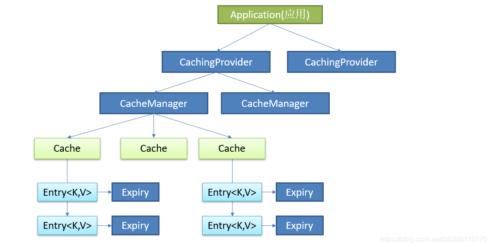

# 缓存

 ==缓存是每一个系统都应该考虑的功能，它用来加速系统的访问，提升系统的性能。== 比如说一些经常需要访问的高频热点数据，例如：电商网站的商品信息。 如果商品信息存储在数据库中，每次来查询商品信息都要来查询数据库的话，这样的操作耗时太大，代价也相对太大。 此时我们可以引入一个缓存中间件，将商品信息存放在缓存中，就不需要直接来查询数据库了。 先来查询缓存中是否有该商品的信息，如果有就直接拿来使用；如果没有的话，然后再去数据库中查询，然后再将数据放回到缓存。==因为应用程序与缓存的交互是非常快的，这样的话就可以大大减缓数据库的压力。==
       再比如：一些临时性的数据，为某个用户的手机号发送了验证码，三分钟有效，过期删除。如果将这些数据存储在数据库中，也是非常有压力的。我们也可以将这些数据存储在缓存中间件中。系统直接从缓存中获取数据即可。

缓存在系统中用的还是非常多的。所以为了统一缓存的开发规范，提升系统的扩展性。J2EE 发布了 JSR-107规范。主要提供了5个接口。

# JSR-107

## 1. 什么是JSR-107

参考: [JSR-107缓存规范介绍](https://blog.csdn.net/lzb348110175/article/details/105341703)

`JSR`是`Java Specification Requests`的缩写，意思是Java 规范提案。2012年10月26日JSR规范委员会发布了JSR 107（JCache API的首个早期草案）。JCache 规范定义了一种对Java对象临时在内存中进行缓存的方法，包括对象的创建、共享访问、假脱机（spooling）、失效、各JVM的一致性等，可被用于缓存JSP内最经常读取的数据。
       Java Caching 定义了5个核心接口，分别是CachingProvider、CacheManager、Cache、Entry 和 Expiry。

| 接口              | **介绍**                                                     |
| ----------------- | ------------------------------------------------------------ |
| `CachingProvider` | **缓存提供者。** 定义了创建、配置、获取、管理和控制多个 CacheManager。一个应用可以在运行期访问多个 CachingProvider。 |
| `CacheManager`    | **缓存管理器。** 定义了创建、配置、获取、管理和控制多个唯一命名的 Cache，这些 Cache 存在于 CacheManager 的上下文中。一个 CacheManager 仅被一个 CachingProvider 所拥有。 |
| `Cache`           | **缓存组件。** 是一个类似 Map 的数据结构并临时存储以 key 为索引的值。一个 Cache 仅被一个 CacheManager 所拥有。 |
| `Entry`           | **键值对。** 是一个存储在 Cache 中的 key-value 对。          |
| `Expiry`          | **有效期。** 每一个存储在 Cache 中的条目有一个定义的有效期。一旦超过这个时间，条目为过期的状态。一旦过期，条目将不可访问、更新和删除。缓存有效期可以通过 ExpiryPolicy 设置。 |

## 2. 应用调用缓存图示

应用来调用缓存，首先会先调用CachingProvider(缓存提供者)，缓存提供者管理了多个CacheManager(缓存管理器)，缓存管理器中才真正的Cache缓存。缓存管理器中可以管理不同类型的缓存，比如：Redis、EhCache 等。

在具体缓存组件中，我们还可以设置不同模块的缓存，比如：Redis 中我们可以来缓存 商品信息、热点数据 等不同模块数据，每个缓存都是Entry<K,V>键值对类型。并且我们可以对缓存设置Expiry过期时间，指定缓存存活的时间。

缓存在我们应用开发中的调用步骤，如下图所示：



# Spring 缓存机制

参考:[Spring 缓存在项目中的使用](https://blog.csdn.net/lzb348110175/article/details/105342363)

## 1. Spring缓存机制介绍

Spring 从 3.1开始，针对缓存定义了org.springframework.cache.Cache和org.springframework.cache.CacheManager接口，来统一不同的缓存技术。并支持使用 JCache（JSR-107规范）注解来简化项目的开发:

- Cache接口为缓存的组件规范定义，包含缓存的各种操作集合;
- Cache接口下Spring提供了各种xxxCache的实现;如RedisCache，EhCacheCache ,ConcurrentMapCache等;
- 每次调用需要缓存功能的方法时，Spring会检查指定参数的指定的目标方法是否已经被调用过﹔如果有就直接从缓存中获取方法调用后的结果，如果没有就调用方法并缓存结果后返回给用户。下次调用直接从缓存中获取。
- 使用Spring缓存抽象时我们需要关注以下两点;
  - 确定方法需要被缓存以及它们的缓存策略
  - 从缓存中读取之前缓存存储的数据

   Spring 的缓存机制非常灵活，可以对容器中任意 Bean 或者 Bean 的方法进行缓存，因此这种缓存机制可以在 JavaEE 应用的任何层次上进行缓存。在缓存的具体实现上，Spring 缓存底层也是借助其他缓存工具来实现的，例如 EhCache(Hibernate缓存工具），上层则以统一 API 编程。

## 2. spring缓存相关概念

1. 两个接口

`Cache`：缓存接口，用来定义缓存的各种操作。Spring提供的具体实现有：RedisCache、EhCacheCache、ConcurrentMapCache等；

`CacheManager`：缓存管理器，管理各种缓存（Cache）组件

2. 三个注解(方法层次)

`@Cacheable`：标注在方法上，能够根据方法的请求参数等对其结果进行缓存。代表一个方法能被缓存

`@CacheEvict`：清空缓存(标注在删除方法上，用来清空缓存)

`@CachePut`：更新缓存。保证方法被调用，同时更新后的结果被缓存。

3. 一个注解(功能层次)

`@EnableCaching`：开启基于注解的缓存（想要使用缓存，就需要开启缓存注解）

4. 两个自定义

`keyGenerator`：缓存数据时key生成策略

`serialize`：缓存数据时 value 值序列化策略

## 3. SpringCache在项目中的使用

项目由Spring Boot + MyBatis-Plus 框架组成 , 展示一下缓存在项目中的使用。

[User实体类](..\cache\src\main\java\com\yves\cache\entity\User.java)

[UserMapper类](..\cache\src\main\java\com\yves\cache\mapper\UserMapper.java)

[UserService类](..\cache\src\main\java\com\yves\cache\service\UserService.java)

[UserServiceImpl类](..\cache\src\main\java\com\yves\cache\service\UserService.java)

[UserController类](..\cache\src\main\java\com\yves\cache\web\UserController.java)

### (1) @EnableCaching 开启基于注解的缓存

```java
@SpringBootApplication
@MapperScan("com.yves.cache.mapper")
@EnableCaching
public class SpringCacheApplication {
    public static void main(String[] args) {
        SpringApplication.run(SpringCacheApplication.class, args);
        System.out.println("启动成功!");
    }
}
```

### (2) @Cacheable

注解表示这个方法有了缓存的功能，方法的返回值会被缓存下来，下一次调用该方法前，会去检查是否缓存中已经有值，如果有就直接返回，不调用方法。如果没有，就调用方法，然后把结果缓存起来。这个注解**一般用在查询方法上**。

```java
// 在UserService或 UserServiceImpl的方法上添加注解
@Cacheable(value = "user")
public User findById(Integer userId);
```

@Cacheable注解共有9个属性可配置，这些属性的配置可参考：**[@Cacheable注解属性介绍](https://blog.csdn.net/lzb348110175/article/details/105349109)**。

### (3) @CachePut

加了`@CachePut`注解的方法，会把方法的返回值put到缓存里面缓存起来，供其它地方使用。它**通常用在新增或更新方法上**。

### (4)@CacheEvict

使用了`CacheEvict`注解的方法，会清空指定缓存。**一般用在更新或者删除的方法上**。

### (5)@Caching

Java注解的机制决定了，一个方法上只能有一个相同的注解生效。那有时候可能一个方法会操作多个缓存（这个在删除缓存操作中比较常见，在添加操作中不太常见）。

Spring Cache当然也考虑到了这种情况，`@Caching`注解就是用来解决这类情况的，源码如下:

```java
public @interface Caching {
    Cacheable[] cacheable() default {};
    CachePut[] put() default {};
    CacheEvict[] evict() default {};
}
```

### (6)@CacheConfig

前面提到的四个注解，都是Spring Cache常用的注解。每个注解都有很多可以配置的属性，这个我们在下一节再详细解释。但这几个注解通常都是作用在方法上的，而有些配置可能又是一个类通用的，这种情况就可以使用`@CacheConfig`了，它是一个类级别的注解，可以在类级别上配置cacheNames、keyGenerator、cacheManager、cacheResolver等。

### (7) 注解参数解读

| 参数名               | 参数方法                                                     |
| -------------------- | ------------------------------------------------------------ |
| `value`/`cacheNames` | 缓存容器名 , 可同时定义多个 如 value={"user"} , 将方法结果保存在名为"user"的缓存容器中 |
| `key`                | 可以通过 key 属性来指定缓存数据所使用的的 key，默认使用的是方法调用传过来的参数作为 key。**`最终缓存中存储的内容格式为：Entry<key,value> 形式。`**<br />  如果请求没有参数：`key=new SimpleKey()；`<br />  如果请求有一个参数：`key=参数的值` <br />  如果请求有多个参数：`key=newSimpleKey(params)；`<br />key值的编写，可以使用 ***SpEL*** 表达式的方式来编写；除此之外，我们同样可以使用 `keyGenerator` 生成器的方式来指定 key，我们只需要编写一个 keyGenerator ，将该生成器注册到 IOC 容器即可。 |
| `keyGenerator `      | **`key 的生成器。`**如果觉得通过参数的方式来指定比较麻烦，我们可以自己指定 key 的生成器的组件 id。key/keyGenerator属性：二选一使用。我们可以通过自定义配置类方式，将 keyGenerator 注册到 IOC 容器来使用。<br />参考代码: [MyCacheConfig](..\cache\src\main\java\com\yves\cache\config\MyCacheConfig.java) |
| `cacheManager `      | **`该属性，用来指定缓存管理器。`**针对不同的缓存技术，需要实现不同的 cacheManager，Spring 也为我们定义了如下的一些 cacheManger 实现:<br />`1. SimpleCacheManager`:使用简单的Collection来存储缓存，主要用于测试<br />`2.ConcurrentMapCacheManager`:使用ConcurrentMap作为缓存技术（默认）<br />`3.NoOpCacheManager`:测试用<br />`4.EhCacheCacheManager`:使用EhCache作为缓存技术，以前在hibernate的时候经常用<br />`5.GuavaCacheManager`:使用google guava的GuavaCache作为缓存技术<br />`6.HazelcastCacheManager`:使用Hazelcast作为缓存技术<br />`7.JCacheCacheManager`:使用JCache标准的实现作为缓存技术，如Apache Commons JCS<br />`8.RedisCacheManager`:使用Redis作为缓存技术 |
| `cacheResolver `     | **`该属性，用来指定缓存管理器。`**使用配置同 cacheManager 类似，可自行百度。（cacheManager指定管理器/cacheResolver指定解析器 它俩也是二选一使用） |
| `condition`          | 条件判断属性，用来指定符合指定的条件下才可以缓存。也可以通过 ***SpEL*** 表达式进行设置。这个配置规则和上面表格中的配置规则是相同的。 |
| `unless`             | unless属性，意为"除非"的意思。即只有 unless 指定的条件为 true 时，方法的返回值才不会被缓存。**`可以在获取到结果后进行判断。`** |
| `sync`               | 该属性用来指定**`是否使用异步模式`**，该属性默认值为 false，默认为同步模式。**`异步模式指定 sync = true 即可，异步模式下 unless 属性不可用。`** |

### (8)SpEL在缓存中的使用

| 名字          | 位置                | 描述                                                         | 示例                 |
| ------------- | ------------------- | ------------------------------------------------------------ | -------------------- |
| methodName    | root  object        | 当前被调用的方法名                                           | #root.method.name    |
| method        | root  object        | 当前被调用的方法                                             | #root.methodName     |
| target        | root  object        | 当前被调用的目标对象                                         | #root.target         |
| targetClass   | root  object        | 当前被调用的目标对象类                                       | #root.targetClass    |
| args          | root  object        | 当前被调用的方法的参数列表                                   | #root.args[0]        |
| caches        | root  object        | 当前方法调用使用的缓存列表(如@Cacheable(value={"cache1  ","cache2")),则有两个cache | #root.caches[0].name |
| argument name | evaluation  context | 方法参数的名字.可以直接#参数名,也可以使用#p0或#a0的形式,0代表参数的索引; | #id、#p0、#a0        |
| result        | evaluation  context | 方法执行后的返回值(仅当方法执行之后的判断有效,如unless'、'cache  put'的表达式'cacheevict'的表达式beforeInvocation=false) | #result              |

使用示例:

```java
@Cacheable(value = "user",key = "#root.method.name")
User getUser(Integer id);
```
<<<<<<< HEAD


# SpringCache源码解析

## 1. Spring Cache 中keyGenerator生成策略源码解析与自定义

一个缓存名对应一个被注解的方法，但是一个方法可能传入不同的参数，那么结果也就会不同，这应该如何区分呢？这就需要用到 key 。在 spring 中，key 的生成有两种方式：显式指定和使用 keyGenerator 自动生成。

### (1) keyGenerator

keyGenerator生成器其实是一个接口，下面先看下其源码：

```java
@FunctionalInterface
public interface KeyGenerator {
	/**
	 * Generate a key for the given method and its parameters.
	 * @param target the target instance
	 * @param method the method being called
	 * @param params the method parameters (with any var-args expanded)
	 * @return a generated key
	 */
	Object generate(Object target, Method method, Object... params);
}
```

### (3) SimpleKeyGenerator

当使用@[Cacheable](https://so.csdn.net/so/search?q=Cacheable&spm=1001.2101.3001.7020)注解并且不显示指定key的时候就会调用默认实现类DefaultKeyGenerator

```java
/**
 * Simple key generator. Returns the parameter itself if a single non-null
 * value is given, otherwise returns a {@link SimpleKey} of the parameters.
 *
 * <p>No collisions will occur with the keys generated by this class.
 * The returned {@link SimpleKey} object can be safely used with a
 * {@link org.springframework.cache.concurrent.ConcurrentMapCache}, however,
 * might not be suitable for all {@link org.springframework.cache.Cache}
 * implementations.
 *
 * @author Phillip Webb
 * @author Juergen Hoeller
 * @since 4.0
 * @see SimpleKey
 * @see org.springframework.cache.annotation.CachingConfigurer
 */
public class SimpleKeyGenerator implements KeyGenerator {

	@Override
	public Object generate(Object target, Method method, Object... params) {
		return generateKey(params);
	}

	/**
	 * Generate a key based on the specified parameters.
	 */
	public static Object generateKey(Object... params) {
		if (params.length == 0) {
			return SimpleKey.EMPTY;
		}
		if (params.length == 1) {
			Object param = params[0];
			if (param != null && !param.getClass().isArray()) {
				return param;
			}
		}
		return new SimpleKey(params);
	}
}
```

```java
/**
 * A simple key as returned from the {@link SimpleKeyGenerator}.
 *
 * @author Phillip Webb
 * @author Juergen Hoeller
 * @since 4.0
 * @see SimpleKeyGenerator
 */
@SuppressWarnings("serial")
public class SimpleKey implements Serializable {

	/**
	 * An empty key.
	 */
	public static final SimpleKey EMPTY = new SimpleKey();


	private final Object[] params;

	// Effectively final, just re-calculated on deserialization
	private transient int hashCode;


	/**
	 * Create a new {@link SimpleKey} instance.
	 * @param elements the elements of the key
	 */
	public SimpleKey(Object... elements) {
		Assert.notNull(elements, "Elements must not be null");
		this.params = elements.clone();
		// Pre-calculate hashCode field
		this.hashCode = Arrays.deepHashCode(this.params);
	}


	@Override
	public boolean equals(@Nullable Object other) {
		return (this == other ||
				(other instanceof SimpleKey && Arrays.deepEquals(this.params, ((SimpleKey) other).params)));
	}

	@Override
	public final int hashCode() {
		// Expose pre-calculated hashCode field
		return this.hashCode;
	}

	@Override
	public String toString() {
		return getClass().getSimpleName() + " [" + StringUtils.arrayToCommaDelimitedString(this.params) + "]";
	}

	private void readObject(ObjectInputStream ois) throws IOException, ClassNotFoundException {
		ois.defaultReadObject();
		// Re-calculate hashCode field on deserialization
		this.hashCode = Arrays.deepHashCode(this.params);
	}
}
```

深度哈希Code源码：

```java
public static int deepHashCode(Object a[]) {
//如果参数为空，返回0
    if (a == null)
        return 0;

    int result = 1;

//不为空，则遍历数组中所有元素，获取到所有元素的哈希值并且累计
    for (Object element : a) {
        int elementHash = 0;
        if (element instanceof Object[])
            elementHash = deepHashCode((Object[]) element);
        else if (element instanceof byte[])
            elementHash = hashCode((byte[]) element);
        else if (element instanceof short[])
            elementHash = hashCode((short[]) element);
        else if (element instanceof int[])
            elementHash = hashCode((int[]) element);
        else if (element instanceof long[])
            elementHash = hashCode((long[]) element);
        else if (element instanceof char[])
            elementHash = hashCode((char[]) element);
        else if (element instanceof float[])
            elementHash = hashCode((float[]) element);
        else if (element instanceof double[])
            elementHash = hashCode((double[]) element);
        else if (element instanceof boolean[])
            elementHash = hashCode((boolean[]) element);
        else if (element != null)
            elementHash = element.hashCode();

        result = 31 * result + elementHash;
    }

    return result;
}
```

> result = 31 * result + elementHash
>
> ==因为任何数n * 31就可以被JVM优化为 (n << 5) -n,移位和减法的操作效率要比乘法的操作效率高的多==
>
> 补充下hashCode基础知识：
>     （1）hashCode是用来在散列存储结构中确定对象的存储地址，能快速的查找；
>     （2）两个对象相同，那么hashCode 一定相同，但是两个hashCode相同的对象不一样相同；
>     （3）如果重写对象的equals方法，那么也尽量重写对象的hashCode方法；


### (3) DefaultKeyGenerator

spring中还有一个简单的生成策略，原理和上面的基本一样，源码如下：

```java
@Deprecated
public class DefaultKeyGenerator implements KeyGenerator {

	public static final int NO_PARAM_KEY = 0;

	public static final int NULL_PARAM_KEY = 53;


	@Override
	public Object generate(Object target, Method method, Object... params) {
        //当没有参数时，返回 0（默认返回0）
		if (params.length == 0) {
			return NO_PARAM_KEY;
		}
        
		if (params.length == 1) {
			Object param = params[0];
            //当有一个参数并且参数为空，则返回53（标识任意值）
			if (param == null) {
				return NULL_PARAM_KEY;
			}
            //如果参数不为空同时参数类型不是数组的时候，则返回当前参数本身
			if (!param.getClass().isArray()) {
				return param;
			}
		}
        //其它情况 返回深度计算的 hashcode
		return Arrays.deepHashCode(params);
	}
}
```

### (4) 自定义KeyGenerator

> 如在参数为map时，要求map里的所有key-value组合作为一个key来做缓存；

```java
@Component
public class MyKeyGenerator implements KeyGenerator {
    @Override
    public Object generate(Object target, Method method, Object... params) {
        if (params.length == 0) {
            return SimpleKey.EMPTY;
        }
        Object param = params[0];
        // 参数为map自定义key=类名+方法名+map的key-value值
        if (param instanceof Map) {
            StringBuilder builder = new StringBuilder();
            String sp = ".";
            builder.append(target.getClass().getSimpleName()).append(sp);
            builder.append(method.getName()).append(sp);
            Map<String, Object> map = (Map<String, Object>) param;
            if (map.isEmpty()) {
                return builder.toString();
            }
            for (String key : map.keySet()) {
                builder.append(key).append("-").append(map.get(key)).append(sp);
            }
            return builder.toString();
        }
        return new SimpleKey(params);
    }
}
```

# SpringBoot+SpringCache+Redis

## 1. CacheProperties

在Springboot 中 `Spring Cache` 的默认配置类是 `CacheProperties`，简单看下有哪些配置属性：

| 属性         | 子属性                                                       | 描述                                                         |
| ------------ | ------------------------------------------------------------ | :----------------------------------------------------------- |
| `type`       | 1. `GENERIC`：通用的缓存类型，使用应用上下文中的`Cache` bean进行缓存。<br />2. `JCACHE`：基于JCache (JSR-107)规范的缓存实现。 <br />3. `EHCACHE`：使用Ehcache作为缓存实现。<br />4. `HAZELCAST`：使用Hazelcast作为缓存实现。 <br />5. `INFINISPAN`：使用Infinispan作为缓存实现。 <br />6. `COUCHBASE`：使用Couchbase作为缓存实现。<br />7. `REDIS`：使用Redis作为缓存实现。<br />8. `CACHE2K`：使用Cache2k作为缓存实现。<br />9. `CAFFEINE`：使用Caffeine作为缓存实现。<br />10. `SIMPLE`：简单的内存缓存实现。<br />11. `NONE`：没有缓存，即不进行任何缓存。 | 缓存类型,在缺省时根据环境自动检测(auto- detected) ， <br />`SIMPLE` 对应的缓存器是基于内存的，其底层存储基于 `ConcurrentHashMap`。 |
| `cacheNames` |                                                              | 如果底层缓存管理器支持，定义要创建的缓存名称列表。通常情况下，这会禁用动态创建其他缓存。 |
| `caffeine`   | `spec`:是创建缓存规范,具体见 CaffeineSpec类                  | Caffeine 作为缓存                                            |
| `couchbase`  | `expiration`:描述过期时间,默认情 况下,内部entries不会过期    | Couchbase怍为缓存                                            |
| `ehcache`    | `config`:用于创建ehcache所提供 的配置文件                    | EhCache作为缓存                                              |
| `infinispan` | `config`:用于创建Infinispan所提供的配置文件                  | Infinispan作为缓存                                           |
| `jcache`     | `config`:用于初始化缓存管理器的配置文件的位置。配置文件依赖于底层 缓存实现。<br />`provider`: CachingProvider实现的完全限定名, 用于检索符合JSR-107的缓存管理器。仅当类路径上有多个JSR-107实现可用时才需要。 | Jcache作为缓存                                               |
|              |                                                              |                                                              |
| `redis `     | `timeToLive`:缓存过期时间 , 默认情况下，永远不会过期。<br />`cacheNullValues`:是否允许缓存null值<br />`keyPrefix`: key前缀<br />`useKeyPrefx`:写入redis时是否使用前缀<br />`enableStatistics`:写入时是否开启缓存指标统计能力 | Redis作为缓存                                                |
=======
>>>>>>> 3172f8da37a5768758654e40e5e93f48d653a647


# 参考资料

[09 Cacheable用法_哔哩哔哩_bilibili](https://www.bilibili.com/video/BV1ex411d7ky/?p=9&spm_id_from=pageDriver&vd_source=73148abc9bb63ed9ac03e82f65b68312)

[Spring Cache，从入门到真香 - 知乎 (zhihu.com)](https://zhuanlan.zhihu.com/p/266804094)

[1 分钟快速上手 Spring Cache - 掘金 (juejin.cn)](https://juejin.cn/post/7067090649245286408)

