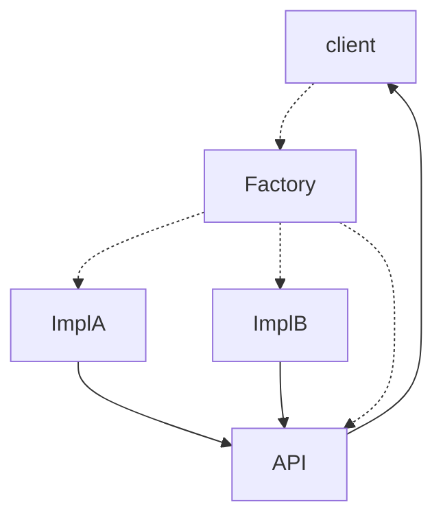
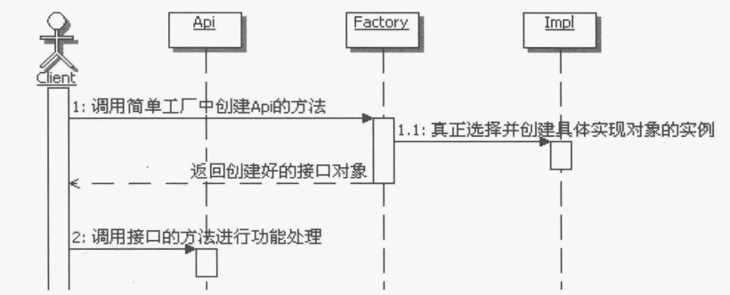

# 简单工厂模式

## 一、问题提出

在Java中需要面向接口编程，但如何在程序中使用接口，做到所谓的面向接口呢？

### 1.不用模式的解决方法

假设有个接口`Api` , 然后有个实现类`impl` 实现了它 , 在客户端或其他方法中调用这个接口的过程如下所示：

```java
public interface Api{
	public void print(String s);
}

public class Impl implements Api{
	public void print(String s){
        System.out.println("打印内容为: "+s);
    }
}

public class Client {
    public static void main(String[] args){
    	Api api = new Impl();
        api.print("打印这句话");
    }
}
```

### 2. 存在的问题

在客户端调用`Api`接口时 , 客户端不但知道了接口 , 同时还知道了具体的实现就是 Impl。接口的思想是“封装隔离”，而实现类 Impl 应该是被接口 Api 封装并同客户端隔离开的，也就是说，客户端根本就不应该知道具体的实现类是 Ipml。

有朋友说，那好，我就把Impl从客户端拿掉，让Api真正地对实现进行“封装隔离”，
然后我们继续面向接口来编程。可是，新的问题出现了，当他把“new ImplO”去掉后，
却发现无法得到Api接口对象了，怎么办呢？

把这个问题描述一下：**在Java编程中，出现只知接口而不知实现，该怎么办？**
**就像现在的Client,.它知道要使用Api接口，但是不知由谁实现，也不知道如何实**
**现，从而得不到接口对象，就无法使用接口，该怎么办呢？**

## 二、使用简单工厂模式

### 1. 简单工厂模式定义

提供一个创建对象实例的功能，而无须关心其具体实现。被创建实例的类型可
以是接口、抽象类，也可以是具体的类

### 2. 应用简单工厂解决问题的思路

分析上面的问题，虽然不能让模块外部知道模块内部的具体实现，但是模块内部是
可以知道实现类的，而且创建接口是需要具体实现类的。

那么，干脆在模块内部新建一个类，在这个类里面来创建接口，然后把创建好的接
口返回给客户端，这样，外部应用就只需要根据这个类来获取相应的接口对象，然后就
可以操作接口定义的方法了。把这样的对象称为简单工厂，就叫它Factory吧。

这样一来，客户端就可以通过Factory来获取需要的接口对象，然后调用接口的方法
来实现需要的功能，而且客户端也不用再关心具体的实现了。



- Api : 定义客户所需要的功能接口
- Impl : 具体实现 Api 的实现类 , 可能会有多个
- Factory : 工厂 , 选择合适的实现类来创建 Api 接口对象
- Client : 客户端 , 通过 Factory 来获取 Api 接口对象

### 3. 简单工厂示例代码

#### (1) 定义Api

```java
public interface Api{
    public void print(String s);
}
```

#### (2) 实现类ImplA

```java
public class ImplA implements Api{
    public void print(String s){
        sout("ImplA打印内容 : "+s);
    }
}
```

#### (3) 实现类ImplB

```java
public class ImplB implements Api{
    public void print(String s){
        sout("ImplB打印内容 : "+s);
    }
}
```

#### (4) 工厂类Factory

```java
public class Factory {
    public static Api createApi(int operation){
        Api api = null;
    	if(operation==1){
            api = ImplA();
        }
        else if(operation==2){
            api = IpmlB();
        }
        else{
        	throw new RunException("不存在该"+int+"Api实现类");
        }
        return api;
    }
}
```

#### (5) 客户端Client

```java
public class Client {
    main(String[] args){
        Api api = Factory.createApi(1);
        api.print("aaaa");//result=> ImplA打印内容 : aaaa
    }
}
```

## 三、模式讲解

### 1. 认识简单工厂

#### (1) 简单工厂的功能

工厂嘛，就是用来创造东西的。在Java里面，通常情况下是用来创造接口的，但是
也可以创造抽象类，甚至是一个具体的类实例。

> 一定要注意，虽然前面的示例是利用简单工厂来创建的接口，但是也可以用筒单工厂来创建抽象类或普通类的实例。

#### (2) 静态工厂

使用简单工厂的时候，通常不用创建简单工厂类的类实例，没有创建实例的必要。因此可以把简单工厂类实现成一个工具类，直接使用静态方法就可以了。也就是说简单工厂的方法通常是静态的，所以也被称为静态工厂。如果要防止客户端无谓地创造简单工厂实例，还可以把简单工厂的构造方法私有化了。

#### (3) 万能工厂
一个简单工厂可以包含很多用来构造东西的方法，这些方法可以创建不同的接口、
抽象类或者是类实例。一个简单工厂理论上可以构造任何东西，所以又称之为“万能工厂"。

虽然上面的实例在简单工厂里面只有一个方法，但事实上，是可以有很多这样的创
建方法的，这点要注意。

#### (4) 简单工厂创建对象的范围

虽然从理论上讲，简单工厂什么都能创建，但对于简单工厂可创建对象的范围，通
常不要太大，建议控制在一个独立的组件级别或者一个模块级别，也就是一个组件或模
块简单工厂。否则这个简单工厂类会职责不明，有点大杂烩的感觉。

#### (5) 简单工厂的调用顺序图



### 2. 简单工厂的写法

虽然说简单工厂的方法大多是用来创建接口的，但是仔细分析就会发现，真正能实
现功能的是具体的实现类，这些实现类是已经做好的，并不是真的要靠简单工厂来创造
出来的，简单工厂的方法无外乎就是：实现了选择一个合适的实现类来使用。

所以说简单工厂方法的内部主要实现的功能是“**==选择合适的实现类==**”来创建实例对
象。既然要实现选择，那么就需要选择的条件或者是选择的参数，选择条件或者是参数
的来源通常又有以下几种。

- 来源于客户端，由Client来传入参数
- 来源于配置文件，从配置文件获取用于判断的值
- 来源于程序运行期的某个值，比如从缓存中获取某个运行期的值

在上面的`简单工厂示例代码`中就采用的第一种由客户端传参的形式获取具体的实现类，由于是从客户端在调用工厂的时候传入选择的参数，这就说明客户端必须知道每个参数的含义，也需要理解每个参数对应的功能处理。这就要求必须在一定程度上，向客户暴露一定的内部实现细节。

### 3. 可配置的简单工厂

如果在每次创建一个新的`Api`实现类时都需要在`Factory`中添加参数判断具体调用哪个实现类显然是很麻烦的一件事情 . 所以我们需要通过外化配置的形式 , 让工厂能自我识别出应该调用的实现类.

一个解决的方法就是使用配置文件，当有了新的实现类后，只要在配置文件里面配置上新的实现类即可。在简单工厂的方法里面可以使用反射，当然也可以使用IoC/DI(控制反转/依赖注入，这个不在这里讨论)来实现。

#### (1) 定义Factory.properties

```properties
ImplClass = com.yves.test.example.Impl2
```

如果此时新添加了实现类 , 可以通过此处修改装配的具体实现类型

#### (2) 工厂类Factory

```java
public class Factory {
    public static Api getApi(){
        // 直接读取配置文件来获取需要创建实例的类
        Properties properties = new Properties();
        InputStream in = null;
        try {
            in = AppTest.class.getResourceAsStream("Factory.properties");
            properties.load(in);
        } catch (IOException e) {
            throw new RuntimeException(e);
        }
        // 用反射去创建具体实现类
        Api api = null;
        try {
            api = (Api) Class.forName(properties.getProperty("ImplClass")).newInstance()
        } catch (InstantiationException e) {
            throw new RuntimeException(e);
        } catch (IllegalAccessException e) {
            throw new RuntimeException(e);
        } catch (ClassNotFoundException e) {
            throw new RuntimeException(e);
        }
        return Api;
    }
}
```

#### (3) 客户端Client

此时的客户端就不再需要传入参数来获取实现类了

```java
public class Client {
    main(String[] args){
        Api api = Factory.getApi();
        api.print("这是个测试");
}
```


## 四、简单工厂的优缺点

### 1. 优点。

- 帮助封装

简单工厂虽然很简单，但是非常友好地帮助我们实现了组件的封装，然后让组
件外部能真正面向接口编程。

- 解耦

通过简单工厂，实现了客户端和具体实现类的解耦。如同上面的例子，客户端根本就不知道具体是由谁来实现，也不知道具体是如何实现的，客户端只是通过工厂获取它需要的接口对象。

### 2. 缺点。

- 可能增加客户端的复杂度

如果通过客户端的参数来选择具体的实现类，那么就必须让客户端能理解各个
参数所代表的具体功能和含义，这样会增加客户端使用的难度，也部分暴露了
内部实现，这种情况可以选用可配置的方式来实现。

- 不方便扩展子工厂

私有化简单工厂的构造方法，使用静态方法来创建接口，也就不能通过写简单
工厂类的子类来改变创建接口的方法的行为了。不过，通常情况下是不需要为
简单工厂创建子类的。

## 五、思考简单工厂

### 1. 简单工厂的本质

**==简单工厂的本质是：选择实现==**

注意简单工厂的重点在选择，实现是已经做好了的。就算实现再简单，也要由具体的实现类来实现，而不是在简单工厂里面来实现。简单工厂的目的在于为客户端来选择相应的实现，从而使得客户端和实现之间解耦。这样一来，具体实现发生了变化，就不用变动客户端了，这个变化会被简单工厂吸收和屏蔽掉。

实现简单工厂的难点就在于“如何选择”实现，前面讲到了几种传递参数的方法，那都是静态的参数，还可以实现成为动态的参数。比如，在运行期间，由工厂去读取某个内存的值，或者是去读取数据库中的值，然后根据这个值来选择具体的实现等。

### 2. 何时选用简单工厂

如果想要完全封装隔离具体实现，让外部只能通过接口来操作封装体，那么可以选用简单工厂，让客户端通过工厂来获取相应的接口，而无须关心具体的实现。

如果想要把对外创建对象的职责集中管理和控制，可以选用简单工厂，一个简
单工厂可以创建很多的、不相关的对象，可以把对外创建对象的职责集中到一
个简单工厂来，从而实现集中管理和控制。

### 3. 相关模式

- 简单工厂和抽象工厂模式

简单工厂是用来选择实现的，可以选择任意接口的实现。一个简单工厂可以有多个用于选择并创建对象的方法，多个方法创建的对象可以有关系也可以没有关系。

抽象工厂模式是用来选择产品簇的实现的，也就是说一般抽象工厂里面有多个用于选择并创建对象的方法，但是这些方法所创建的对象之间通常是有关系的，这些被创建的对象通常是构成一个产品簇所需要的部件对象。

所以从某种意义上来说，简单工厂和抽象工厂是类似的，如果抽象工厂退化成为只有一个实现，不分层次，那么就相当于简单工厂了。

- 简单工厂和工厂方法模式

简单工厂和工厂方法模式也是非常类似的。工厂方法的本质也是用来选择实现的，跟简单工厂的区别在于工厂方法是把选择具体实现的功能延迟到子类去实现。如果把工厂方法中选择的实现放到父类直接实现，那就等同于简单工厂。

- 简单工厂和能创建对象实例的模式

简单工厂的本质是选择实现，所以它可以跟其他任何能够具体的创建对象实例
的模式配合使用，比如：单例模式、原型模式、生成器模式等。